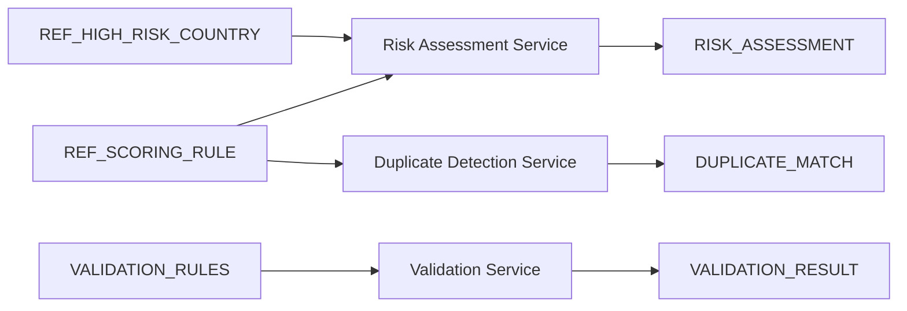

# ATP Database Schema Design

## Purpose

This document is the authoritative reviewed ATP schema design and expands Section 7 of `technical-design.md` into a complete table-box-and-connector view similar to the supplied reference image. `db-schema.dbml` is maintained as its implementation-ready, machine-readable physical equivalent.

## Scope and Conventions

- The full ERD contains all 18 ATP tables and all 17 physical foreign-key relationships.
- `PK` identifies a primary-key column, `FK` identifies a foreign-key column, and `UK` identifies a unique alternate key.
- A required relationship means the child foreign-key column is marked `not null` in DBML. An optional relationship means the foreign-key column is nullable.
- The crow-foot end represents zero or many child records.
- Configuration tables without foreign keys remain physically standalone; their runtime use is shown separately and is not presented as a database constraint.

## Table Inventory

| Domain | Tables | Count |
|---|---|---:|
| Core request and workflow | `SUPPLIER_REQUEST`, `SUPPLIER_REQUEST_SITE`, `SUPPLIER_REQUEST_CONTACT`, `SUPPLIER_REQUEST_BANK`, `SUPPLIER_REQUEST_DOCUMENT`, `STATUS_HISTORY` | 6 |
| Rule and AI outputs | `VALIDATION_RESULT`, `DUPLICATE_MATCH`, `RISK_ASSESSMENT`, `AI_SUMMARY` | 4 |
| Integration and supplier reference | `EXISTING_SUPPLIER_REF`, `EXISTING_SUPPLIER_SITE_REF`, `INTEGRATION_LOG` | 3 |
| Governed reference configuration | `VALIDATION_RULES`, `REF_BUSINESS_UNIT`, `REF_SUPPLIER_TYPE`, `REF_HIGH_RISK_COUNTRY`, `REF_SCORING_RULE` | 5 |
| **Total** |  | **18** |

## Complete Physical ER Diagram

```mermaid
erDiagram
    SUPPLIER_REQUEST {
        int request_id PK
        varchar request_number UK
        varchar status
        varchar supplier_name
        varchar supplier_type_code FK
        varchar country_code
        int business_unit_id FK
        varchar requester_user
        text business_justification
        varchar product_service_category
        decimal expected_annual_spend
        varchar tax_registration_number
        varchar fusion_supplier_id
        varchar fusion_supplier_number
        timestamp fusion_created_at
        varchar fusion_response_ref
        timestamp created_at
        timestamp submitted_at
        timestamp last_updated_at
    }
    SUPPLIER_REQUEST_SITE {
        int site_id PK
        int request_id FK
        varchar site_name
        varchar country_code
        varchar address_line1
        varchar address_line2
        varchar city
        varchar region
        varchar postal_code
        int intended_business_unit_id FK
        boolean is_primary
    }
    SUPPLIER_REQUEST_CONTACT {
        int contact_id PK
        int request_id FK
        varchar contact_name
        varchar contact_email
        varchar phone_number
        varchar email_domain
    }
    SUPPLIER_REQUEST_BANK {
        int bank_id PK
        int request_id FK
        varchar bank_country_code
        varchar masked_account_display
        varchar account_last4
        varchar account_hash
        boolean bank_provided_flag
    }
    SUPPLIER_REQUEST_DOCUMENT {
        int document_id PK
        int request_id FK
        varchar document_type
        varchar document_status
        boolean is_required
        json metadata_json
        boolean missing_flag
    }
    STATUS_HISTORY {
        int history_id PK
        int request_id FK
        varchar from_status
        varchar to_status
        varchar action_code
        varchar actor_user
        text action_comment
        timestamp action_timestamp
    }
    VALIDATION_RESULT {
        int validation_id PK
        int request_id FK
        int validation_rule_id FK
        varchar run_id
        boolean is_current
        varchar field_name
        varchar severity
        text message
        boolean is_blocking
        timestamp created_at
    }
    DUPLICATE_MATCH {
        int match_id PK
        int request_id FK
        varchar run_id
        boolean is_current
        varchar candidate_source
        int candidate_supplier_ref_id FK
        varchar candidate_supplier_number
        varchar candidate_supplier_name
        int candidate_request_id FK
        decimal match_score
        varchar match_level
        json matched_fields_json
        text explanation
        timestamp created_at
    }
    RISK_ASSESSMENT {
        int risk_id PK
        int request_id FK
        varchar run_id
        boolean is_current
        decimal risk_score
        varchar risk_level
        varchar scoring_version
        json risk_reasons_json
        timestamp created_at
    }
    AI_SUMMARY {
        int summary_id PK
        int request_id FK
        varchar prompt_version
        varchar provider_name
        varchar model_name
        json summary_json
        varchar source_facts_hash
        timestamp created_at
        varchar created_by
    }
    EXISTING_SUPPLIER_REF {
        int supplier_ref_id PK
        varchar fusion_supplier_id
        varchar supplier_number UK
        varchar supplier_name
        varchar normalized_name
        varchar country_code
        varchar tax_registration_number
        varchar email_domain
        varchar phone_normalized
        varchar address_normalized
        varchar bank_account_hash
        timestamp last_sync_at
    }
    EXISTING_SUPPLIER_SITE_REF {
        int site_ref_id PK
        int supplier_ref_id FK
        varchar fusion_site_id
        varchar site_name
        varchar country_code
        varchar address_normalized
        varchar business_unit_code
    }
    INTEGRATION_LOG {
        int log_id PK
        int request_id FK
        varchar integration_name
        varchar oic_instance_id
        varchar direction
        varchar status
        varchar error_category
        varchar payload_ref
        varchar response_ref
        text user_message
        text technical_message
        int retry_count
        boolean retry_eligible_flag
        timestamp last_retry_at
        varchar last_retry_by
        json retry_history_json
        timestamp created_at
    }
    REF_BUSINESS_UNIT {
        int business_unit_id PK
        varchar business_unit_code UK
        varchar business_unit_name
        varchar fusion_mapping_code
        boolean active_flag
        timestamp created_at
        varchar created_by
        timestamp updated_at
        varchar updated_by
    }
    REF_SUPPLIER_TYPE {
        int supplier_type_id PK
        varchar supplier_type_code UK
        varchar supplier_type_name
        boolean tax_required_flag
        boolean active_flag
        timestamp created_at
        varchar created_by
        timestamp updated_at
        varchar updated_by
    }
    REF_HIGH_RISK_COUNTRY {
        varchar country_code PK
        date effective_from PK
        varchar country_name
        varchar risk_level
        boolean active_flag
        date effective_to
        timestamp created_at
        varchar created_by
        timestamp updated_at
        varchar updated_by
    }
    VALIDATION_RULES {
        int validation_rule_id PK
        varchar rule_code UK
        varchar rule_name
        text rule_description
        varchar field_name
        varchar severity
        text default_message
        boolean is_blocking
        boolean active_flag
        timestamp created_at
        varchar created_by
        timestamp updated_at
        varchar updated_by
    }
    REF_SCORING_RULE {
        varchar rule_code PK
        varchar version PK
        varchar rule_type PK
        varchar rule_name
        decimal weight
        varchar severity
        boolean critical_trigger_flag
        boolean active_flag
        timestamp created_at
        varchar created_by
        timestamp updated_at
        varchar updated_by
    }
    REF_BUSINESS_UNIT o|--o{ SUPPLIER_REQUEST : classifies
    REF_SUPPLIER_TYPE o|--o{ SUPPLIER_REQUEST : categorizes
    SUPPLIER_REQUEST ||--o{ SUPPLIER_REQUEST_SITE : has
    REF_BUSINESS_UNIT o|--o{ SUPPLIER_REQUEST_SITE : maps
    SUPPLIER_REQUEST ||--o{ SUPPLIER_REQUEST_CONTACT : has
    SUPPLIER_REQUEST ||--o{ SUPPLIER_REQUEST_BANK : may_have
    SUPPLIER_REQUEST ||--o{ SUPPLIER_REQUEST_DOCUMENT : tracks
    SUPPLIER_REQUEST ||--o{ STATUS_HISTORY : records
    SUPPLIER_REQUEST ||--o{ VALIDATION_RESULT : produces
    VALIDATION_RULES ||--o{ VALIDATION_RESULT : identifies
    SUPPLIER_REQUEST ||--o{ DUPLICATE_MATCH : produces
    EXISTING_SUPPLIER_REF o|--o{ DUPLICATE_MATCH : candidate
    SUPPLIER_REQUEST o|--o{ DUPLICATE_MATCH : candidate
    SUPPLIER_REQUEST ||--o{ RISK_ASSESSMENT : produces
    SUPPLIER_REQUEST ||--o{ AI_SUMMARY : produces
    EXISTING_SUPPLIER_REF ||--o{ EXISTING_SUPPLIER_SITE_REF : has
    SUPPLIER_REQUEST ||--o{ INTEGRATION_LOG : logs
```

### Text Alternative

`SUPPLIER_REQUEST` is the central workflow table. It owns request sites, contacts, optional masked bank details, document metadata, status history, validation results, duplicate results, risk assessments, AI summaries, and integration logs. Every failed `VALIDATION_RESULT` references the exact `VALIDATION_RULES` definition that failed. `REF_BUSINESS_UNIT` and `REF_SUPPLIER_TYPE` classify requests, while `REF_BUSINESS_UNIT` also maps intended request sites. `DUPLICATE_MATCH` can point either to an existing Fusion supplier reference or another staged request. Each `INTEGRATION_LOG` belongs to its originating request and embeds retry attempts in `retry_history_json`, eliminating a separate retry-history relationship. Existing supplier sites belong to existing supplier references. `REF_HIGH_RISK_COUNTRY` and the consolidated `REF_SCORING_RULE` have no physical foreign keys by design.

## Physical Relationship Catalog

| Child foreign key | Referenced parent key | Child requirement | Cardinality |
|---|---|---|---|
| `SUPPLIER_REQUEST.business_unit_id` | `REF_BUSINESS_UNIT.business_unit_id` | Optional | Zero or one parent per child; zero or many children per parent |
| `SUPPLIER_REQUEST.supplier_type_code` | `REF_SUPPLIER_TYPE.supplier_type_code` | Optional | Zero or one parent per child; zero or many children per parent |
| `SUPPLIER_REQUEST_SITE.request_id` | `SUPPLIER_REQUEST.request_id` | Required | One parent per child; zero or many children per parent |
| `SUPPLIER_REQUEST_SITE.intended_business_unit_id` | `REF_BUSINESS_UNIT.business_unit_id` | Optional | Zero or one parent per child; zero or many children per parent |
| `SUPPLIER_REQUEST_CONTACT.request_id` | `SUPPLIER_REQUEST.request_id` | Required | One parent per child; zero or many children per parent |
| `SUPPLIER_REQUEST_BANK.request_id` | `SUPPLIER_REQUEST.request_id` | Required | One parent per child; zero or many children per parent |
| `SUPPLIER_REQUEST_DOCUMENT.request_id` | `SUPPLIER_REQUEST.request_id` | Required | One parent per child; zero or many children per parent |
| `STATUS_HISTORY.request_id` | `SUPPLIER_REQUEST.request_id` | Required | One parent per child; zero or many children per parent |
| `VALIDATION_RESULT.request_id` | `SUPPLIER_REQUEST.request_id` | Required | One parent per child; zero or many children per parent |
| `VALIDATION_RESULT.validation_rule_id` | `VALIDATION_RULES.validation_rule_id` | Required | One parent per child; zero or many children per parent |
| `DUPLICATE_MATCH.request_id` | `SUPPLIER_REQUEST.request_id` | Required | One parent per child; zero or many children per parent |
| `DUPLICATE_MATCH.candidate_supplier_ref_id` | `EXISTING_SUPPLIER_REF.supplier_ref_id` | Optional | Zero or one parent per child; zero or many children per parent |
| `DUPLICATE_MATCH.candidate_request_id` | `SUPPLIER_REQUEST.request_id` | Optional | Zero or one parent per child; zero or many children per parent |
| `RISK_ASSESSMENT.request_id` | `SUPPLIER_REQUEST.request_id` | Required | One parent per child; zero or many children per parent |
| `AI_SUMMARY.request_id` | `SUPPLIER_REQUEST.request_id` | Required | One parent per child; zero or many children per parent |
| `EXISTING_SUPPLIER_SITE_REF.supplier_ref_id` | `EXISTING_SUPPLIER_REF.supplier_ref_id` | Required | One parent per child; zero or many children per parent |
| `INTEGRATION_LOG.request_id` | `SUPPLIER_REQUEST.request_id` | Required | One parent per child; zero or many children per parent |

## Logical Configuration Usage

The following connections describe application behavior only. They are not database foreign keys.

Text alternative: the risk assessment service reads high-risk-country configuration and `RISK` rows from `REF_SCORING_RULE` before writing `RISK_ASSESSMENT`. The duplicate detection service reads `DUPLICATE` rows from the same scoring table before writing `DUPLICATE_MATCH`. The validation service reads active `VALIDATION_RULES` entries before writing failed `VALIDATION_RESULT` rows. These arrows show service-level consumption; the validation result-to-rule relationship is also enforced by the physical foreign key in the ERD.

## Required Validation-Rule Seed Catalog

| Rule code | Rule name | Governed condition | Default behavior |
|---|---|---|---|
| `VAL-001` | Supplier name required | Supplier name is empty. | Blocking, active |
| `VAL-002` | Country required | Supplier country is empty. | Blocking, active |
| `VAL-003` | Supplier type required | Supplier type is empty. | Blocking, active |
| `VAL-004` | Business unit required and mapped | Business unit is empty or has no valid mapping. | Blocking, active |
| `VAL-005` | Contact email required and valid | Contact email is empty or malformed. | Blocking, active |
| `VAL-006` | Structured address complete | Required address/site fields are incomplete or either address line exceeds 20 characters. | Blocking, active |
| `VAL-007` | Supplier site required | No supplier site is present. | Blocking, active |
| `VAL-008` | Exact tax duplicate blocked | Exact tax registration matches an existing supplier or relevant staged request. | Blocking, active |
| `VAL-009` | Same bank token duplicate blocked | Captured bank token/hash matches another supplier or relevant staged request. | Blocking, active |

## Important Schema Rules

- `SUPPLIER_REQUEST.request_number` and `EXISTING_SUPPLIER_REF.supplier_number` are unique business identifiers.
- `REF_HIGH_RISK_COUNTRY` uses the composite primary key `country_code` plus `effective_from`.
- `VALIDATION_RULES.validation_rule_id` is the technical primary key and `rule_code` is a stable unique identifier for `VAL-001` through `VAL-009`.
- Every `VALIDATION_RESULT` requires a `validation_rule_id`; run-specific severity, message, and blocking values preserve the result snapshot.
- `REF_SCORING_RULE` uses the composite primary key `rule_type` plus `rule_code` plus `version`; `rule_type` is constrained to `RISK` or `DUPLICATE`.
- Request corrections preserve historical validation, duplicate, and risk runs through `run_id` and `is_current`.
- A duplicate match may reference an existing supplier, a staged supplier request, or neither when only explanatory evidence is retained; application rules must validate `candidate_source` consistently.
- Bank-account data is limited to masked display, last-four, and hash/token fields. No full bank account number is modeled.
- `INTEGRATION_LOG.retry_history_json` is a required append-only array. Every entry contains attempt number, actor, timestamp, result, message, and retry OIC instance ID.
- A retry transaction atomically appends one JSON entry, increments `retry_count`, and updates `last_retry_at`, `last_retry_by`, and the current integration outcome; `retry_count` must equal the JSON array length.
- Reference data is deactivated through `active_flag` rather than deleted when historical records depend on it.

## Source Traceability

| Source | Role |
|---|---|
| `technical-design.md`, Section 7 | Approved logical model, constraints, indexes, and implementation notes |
| `db-schema.dbml` | Implementation-ready table, field, key, index, and relationship baseline |
| Supplied schema image | Presentation reference for table boxes connected by relationship lines |

## Validation Summary

- Tables represented: 18 of 18.
- Columns represented: 189 of 189.
- Physical relationships represented: 17 of 17.
- Standalone configuration tables are present without fabricated foreign keys.
- Mermaid entity identifiers use uppercase alphanumeric and underscore characters only.
- A complete text alternative and explicit relationship catalog are included.
