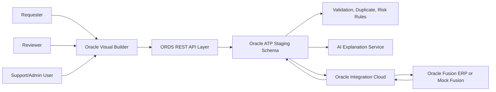
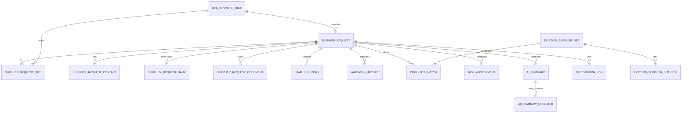

# Technical Design

## Document Status

- **Project**: Supplier Onboarding, Duplicate Detection, and Risk Scoring
- **Phase**: AI-DLC Inception / Application Design
- **Status**: Complete for proposal review and wireframe preparation; final implementation design depends on customer tenancy, security, and Fusion API validation
- **Wireframes**: Explicitly deferred until requirements/design review is complete

## 1. Executive Technical Summary

The solution is a staged supplier onboarding application. Visual Builder provides the user experience, ORDS exposes controlled REST APIs over ATP, ATP stores workflow and rule outputs, OIC integrates with Oracle Fusion ERP, and Fusion remains the supplier master system of record.

Core design principle: the UI never creates suppliers directly in Fusion. Supplier data is first staged, validated, duplicate-checked, risk-scored, reviewed, and only then submitted to Fusion through OIC.

## 2. Architecture



Text alternative: users work in Visual Builder. Visual Builder calls ORDS. ORDS reads and writes ATP. ATP stores requests, validations, duplicate results, risk results, AI summaries, reference data, and integration logs. OIC reads approved requests from ATP/ORDS, creates suppliers in Fusion or mock Fusion, and writes the result back to ATP.

## 3. Logical Components

| Component | Responsibility | Notes |
|---|---|---|
| Visual Builder App | Request, review, dashboard, and support/admin screens. | Uses service connections to ORDS APIs. |
| ORDS API Layer | REST facade over ATP procedures/tables. | Enforces endpoint contracts, role checks, and error envelopes. |
| ATP Staging Schema | Source for request workflow state and audit records. | Not supplier master system of record. |
| Validation Engine | Mandatory, conditional, and business mapping validation. | Implemented in ATP PL/SQL package or service layer behind ORDS. |
| Duplicate Detection Engine | Exact/fuzzy matching against supplier reference and staged requests. | Deterministic, explainable, persisted. |
| Risk Scoring Engine | Rule-based risk scoring and risk reason generation. | Deterministic, versioned, configurable. |
| AI Explanation Service | Plain-language risk and duplicate summary. | Does not make decisions. Provider pending. |
| Review Workflow Service | Controls reviewer actions and status transitions. | Prevents review bypass. |
| OIC Supplier Submit Flow | Creates supplier in Fusion or mock endpoint. | Captures Fusion response and errors. |
| OIC Supplier Reference Sync Flow | Loads existing suppliers into ATP. | Real Fusion sync or mock seed data. |
| Integration Observability | Logs OIC instance, payload/response references, errors, retries. | Support/admin visible. |

## 4. Deployment and Environment Assumptions

| Area | Baseline Assumption |
|---|---|
| UI | Oracle Visual Builder web application. |
| Database | Oracle ATP with application schema for staging and rules. |
| API | ORDS module with versioned base path. |
| Integration | Oracle Integration Cloud REST/database adapters and Fusion REST APIs or mock endpoints. |
| Fusion | Oracle Fusion ERP is system of record after successful creation. |
| Identity | Customer SSO/IDCS/OCI IAM mapping to application roles, exact setup pending. |
| AI | Customer-approved AI provider or mocked AI summary for demo, exact provider pending. |
| Prototype Volume | Few hundred supplier reference rows and 50-100 supplier requests. |

## 5. Persona-Based Access Model

| Capability | Requester | Reviewer | Support/Admin |
|---|---:|---:|---:|
| Create draft request | Yes | No | Optional support only |
| Submit own request | Yes | No | Optional support only |
| View own request status | Yes | No | Yes |
| View review queue | No | Yes | Yes |
| View duplicate/risk details | Own request summary only | Yes | Yes |
| Approve/reject/request correction/mark duplicate | No | Yes | No by default |
| View integration logs | No | Limited business status only | Yes |
| Retry integration failures | No | No | Yes |
| Maintain reference data | No | No | Yes |

## 6. Request Status Model

| Status | Entry Trigger | Allowed Next Statuses | Notes |
|---|---|---|---|
| Draft | Request created/saved | Submitted | Not visible in review queue. |
| Submitted | Requester submits | Validation Failed, Under Review | Validation and scoring run. |
| Validation Failed | Blocking validation error | Correction Requested, Under Review after correction | Business error, not technical failure. |
| Under Review | Validation complete or warnings only | Approved, Rejected, Correction Requested, Marked Duplicate | Reviewer decision required. |
| Correction Requested | Reviewer requests correction | Submitted | Requester edits and resubmits. |
| Approved | Reviewer approves | Submitted to Fusion | Eligible for OIC submission. |
| Rejected | Reviewer rejects | Final for phase one | Requires comment. |
| Marked Duplicate | Reviewer confirms duplicate | Final for phase one | Requires existing supplier reference. |
| Submitted to Fusion | OIC submit started | Created in Fusion, Integration Failed | Technical/integration lifecycle. |
| Created in Fusion | Fusion/mock success | Final | Store supplier number. |
| Integration Failed | OIC/Fusion error | Submitted to Fusion after retry, Correction Requested if business mapping issue | Retry only if eligible. |

## 7. ATP Data Model

### 7.1 Core Tables

| Table | Key Columns | Purpose |
|---|---|---|
| SUPPLIER_REQUEST | request_id, request_number, status, supplier_name, supplier_type, country_code, business_unit_id, requester_user, business_justification, product_service_category, expected_annual_spend, tax_registration_number, created_at, submitted_at, last_updated_at | Header record and workflow state. |
| SUPPLIER_REQUEST_SITE | site_id, request_id, site_name, country_code, address_line1, address_line2, city, region, postal_code, intended_business_unit_id, is_primary | At least one site or site context. |
| SUPPLIER_REQUEST_CONTACT | contact_id, request_id, contact_name, contact_email, phone_number, email_domain | Contact data and duplicate signal source. |
| SUPPLIER_REQUEST_BANK | bank_id, request_id, bank_country_code, masked_account_display, account_last4, account_hash, bank_provided_flag | Optional bank data with masked/tokenized duplicate support. |
| SUPPLIER_REQUEST_DOCUMENT | document_id, request_id, document_type, document_status, is_required, metadata_json, missing_flag | Metadata and missing-document flags; upload optional. |
| STATUS_HISTORY | history_id, request_id, from_status, to_status, action_code, actor_user, action_comment, action_timestamp | Auditable status transitions. |

### 7.2 Rule Output Tables

| Table | Key Columns | Purpose |
|---|---|---|
| VALIDATION_RESULT | validation_id, request_id, field_name, rule_code, severity, message, is_blocking, created_at | Business validation results. |
| DUPLICATE_MATCH | match_id, request_id, candidate_source, candidate_supplier_id, candidate_supplier_number, candidate_supplier_name, match_score, match_level, matched_fields_json, explanation, created_at | Duplicate candidates and reasons. |
| RISK_ASSESSMENT | risk_id, request_id, risk_score, risk_level, scoring_version, risk_reasons_json, created_at | Risk score and explainable reasons. |
| AI_SUMMARY | summary_id, request_id, prompt_version, provider_name, model_name, summary_json, source_facts_hash, created_at, created_by | AI explanation history. |
| AI_SUMMARY_FEEDBACK | feedback_id, summary_id, request_id, helpful_flag, feedback_comment, actor_user, created_at | Optional future AI feedback. |

### 7.3 Integration and Reference Tables

| Table | Key Columns | Purpose |
|---|---|---|
| EXISTING_SUPPLIER_REF | supplier_ref_id, fusion_supplier_id, supplier_number, supplier_name, normalized_name, country_code, tax_registration_number, email_domain, phone_normalized, address_normalized, bank_account_hash, last_sync_at | Duplicate reference data from Fusion/mock. |
| EXISTING_SUPPLIER_SITE_REF | site_ref_id, supplier_ref_id, fusion_site_id, site_name, country_code, address_normalized, business_unit_code | Supplier site reference data. |
| INTEGRATION_LOG | log_id, request_id, integration_name, oic_instance_id, direction, status, payload_ref, response_ref, user_message, technical_message, retry_count, retry_eligible_flag, created_at | OIC/Fusion observability. |
| REF_BUSINESS_UNIT | business_unit_id, business_unit_code, business_unit_name, fusion_mapping_code, active_flag | Business unit lookup/mapping. |
| REF_SUPPLIER_TYPE | supplier_type_id, supplier_type_code, supplier_type_name, tax_required_flag, active_flag | Supplier type lookup. |
| REF_HIGH_RISK_COUNTRY | country_code, country_name, risk_level, active_flag, effective_from, effective_to | Configurable country risk. |
| REF_RISK_RULE | rule_code, rule_name, weight, severity, active_flag, version | Risk scoring configuration. |
| REF_DUPLICATE_RULE | rule_code, rule_name, weight, critical_trigger_flag, active_flag, version | Duplicate scoring configuration. |

### 7.4 Data Relationship Model



Text alternative: `SUPPLIER_REQUEST` is the parent entity for the request workflow. Child records capture sites, contacts, optional bank/document metadata, status history, validation outputs, duplicate matches, risk assessments, AI summaries, and integration logs. Reference tables provide business-unit, supplier-type, high-risk-country, duplicate-rule, and risk-rule configuration. Existing supplier reference tables provide the candidate records used by duplicate detection.

### 7.5 Database Schema Design Detail

The following schema design is sufficient for wireframes, API contracts, and prototype DDL generation. Physical names may be adjusted to match the customer's database naming standards during implementation.

| Table | Primary Key | Foreign Keys / Relationships | Required Constraints and Indexes |
|---|---|---|---|
| SUPPLIER_REQUEST | request_id | business_unit_id -> REF_BUSINESS_UNIT.business_unit_id; supplier_type -> REF_SUPPLIER_TYPE.supplier_type_code | Unique request_number; index status, requester_user, country_code, submitted_at; check expected_annual_spend >= 0; status constrained to approved status list. |
| SUPPLIER_REQUEST_SITE | site_id | request_id -> SUPPLIER_REQUEST.request_id; intended_business_unit_id -> REF_BUSINESS_UNIT.business_unit_id | Index request_id; require country_code and address_line1 for submitted requests; one primary site per request by filtered/functional unique rule where supported. |
| SUPPLIER_REQUEST_CONTACT | contact_id | request_id -> SUPPLIER_REQUEST.request_id | Index request_id and email_domain; validate contact_email format in service/rule layer; normalize email_domain for matching. |
| SUPPLIER_REQUEST_BANK | bank_id | request_id -> SUPPLIER_REQUEST.request_id | Index request_id and account_hash; never store unmasked account number; account_hash nullable when bank data is not provided. |
| SUPPLIER_REQUEST_DOCUMENT | document_id | request_id -> SUPPLIER_REQUEST.request_id | Index request_id, document_type, missing_flag; metadata_json stores document metadata only for phase one. |
| STATUS_HISTORY | history_id | request_id -> SUPPLIER_REQUEST.request_id | Index request_id and action_timestamp; action_comment required for reject, correction, and duplicate decisions. |
| VALIDATION_RESULT | validation_id | request_id -> SUPPLIER_REQUEST.request_id | Index request_id, rule_code, is_blocking; active validation result set should be replaced or versioned per validation run. |
| DUPLICATE_MATCH | match_id | request_id -> SUPPLIER_REQUEST.request_id; candidate_supplier_id may reference EXISTING_SUPPLIER_REF.supplier_ref_id for Fusion/mock candidates | Index request_id, match_level, match_score; matched_fields_json stores explainable signal details. |
| RISK_ASSESSMENT | risk_id | request_id -> SUPPLIER_REQUEST.request_id | Index request_id, risk_level, created_at; risk_reasons_json stores factor-level reasons and weights. |
| AI_SUMMARY | summary_id | request_id -> SUPPLIER_REQUEST.request_id | Index request_id, prompt_version, created_at; source_facts_hash supports traceability to the risk/duplicate facts used. |
| AI_SUMMARY_FEEDBACK | feedback_id | summary_id -> AI_SUMMARY.summary_id; request_id -> SUPPLIER_REQUEST.request_id | Optional/future table; index summary_id and request_id. |
| EXISTING_SUPPLIER_REF | supplier_ref_id | None | Unique supplier_number where available; index normalized_name, country_code, tax_registration_number, email_domain, bank_account_hash. |
| EXISTING_SUPPLIER_SITE_REF | site_ref_id | supplier_ref_id -> EXISTING_SUPPLIER_REF.supplier_ref_id | Index supplier_ref_id, country_code, business_unit_code, address_normalized. |
| INTEGRATION_LOG | log_id | request_id -> SUPPLIER_REQUEST.request_id | Index request_id, integration_name, status, oic_instance_id, retry_eligible_flag; payload/response values should be references, not raw sensitive payloads. |
| REF_BUSINESS_UNIT | business_unit_id | None | Unique business_unit_code; active_flag check; fusion_mapping_code required for active values used in Fusion payloads. |
| REF_SUPPLIER_TYPE | supplier_type_id | None | Unique supplier_type_code; active_flag check; tax_required_flag drives validation rules. |
| REF_HIGH_RISK_COUNTRY | country_code, effective_from | None | Index active_flag and effective dates; overlapping active ranges should be prevented by rule/data load control. |
| REF_RISK_RULE | rule_code, version | None | Index active_flag and severity; weight numeric and non-negative. |
| REF_DUPLICATE_RULE | rule_code, version | None | Index active_flag and critical_trigger_flag; weight numeric and non-negative. |

### 7.6 Schema Implementation Notes

- Use generated numeric identities or UUIDs for technical primary keys, depending on customer ATP standards.
- Use UTC timestamps for audit fields and display localized values in Visual Builder.
- Store JSON details in `*_json` fields only for explainability payloads that are naturally variable, such as matched duplicate fields and risk reasons.
- Keep normalized duplicate-search fields separate from original display values.
- Apply soft deactivation to reference data through `active_flag`; do not delete reference rows used by historical requests.
- Use database constraints for structural integrity and service-layer rules for conditional business validation.
- Keep full bank account values out of ATP unless the customer explicitly approves secure encrypted storage; the prototype baseline stores masked display and hash/token values only.

## 8. ORDS API Design

### 8.1 API Base

Recommended base path:

```text
/ords/erp/supplier-onboarding/v1
```

### 8.2 Response Envelope

Successful response:

```json
{
  "success": true,
  "data": {},
  "messages": [],
  "correlationId": "REQ-2026-000123"
}
```

Error response:

```json
{
  "success": false,
  "error": {
    "category": "BUSINESS_VALIDATION",
    "code": "SUPPLIER_NAME_REQUIRED",
    "message": "Supplier name is required.",
    "technicalMessage": null,
    "retryEligible": false
  },
  "correlationId": "REQ-2026-000123"
}
```

### 8.3 HTTP Status Guidance

| HTTP Status | Use |
|---:|---|
| 200 | Successful read/action. |
| 201 | Request created. |
| 400 | Invalid request payload or business validation issue. |
| 401 | Unauthenticated. |
| 403 | Authenticated but not authorized for action. |
| 404 | Request/resource not found. |
| 409 | Invalid status transition or duplicate conflict. |
| 422 | Semantically valid payload but rule validation failed. |
| 500 | Unexpected server error. |
| 502/504 | Downstream OIC/Fusion timeout or gateway failure where exposed through ORDS. |

### 8.4 Endpoint Catalog

| Method | Endpoint | Roles | Purpose |
|---|---|---|---|
| POST | `/requests` | Requester | Create draft request. |
| GET | `/requests` | Requester, Reviewer, Support/Admin | List requests with role-aware scope and filters. |
| GET | `/requests/{requestId}` | Requester owner, Reviewer, Support/Admin | Retrieve request detail. |
| PATCH | `/requests/{requestId}` | Requester owner | Update Draft or Correction Requested request. |
| POST | `/requests/{requestId}/submit` | Requester owner | Submit for validation/review. |
| POST | `/requests/{requestId}/validate` | Reviewer, Support/Admin, System | Run validation. |
| GET | `/requests/{requestId}/validation-results` | Requester owner, Reviewer, Support/Admin | Retrieve validation findings. |
| POST | `/requests/{requestId}/duplicate-check` | Reviewer, Support/Admin, System | Run persisted duplicate check. |
| POST | `/duplicate-preview` | Requester | Optional early duplicate warning. |
| GET | `/requests/{requestId}/duplicate-matches` | Requester owner summary, Reviewer, Support/Admin | Retrieve duplicate matches. |
| POST | `/requests/{requestId}/risk-score` | Reviewer, Support/Admin, System | Calculate risk. |
| GET | `/requests/{requestId}/risk-assessment` | Requester owner summary, Reviewer, Support/Admin | Retrieve risk assessment. |
| POST | `/requests/{requestId}/ai-summary` | Reviewer, Support/Admin | Generate/regenerate AI summary. |
| GET | `/requests/{requestId}/ai-summaries` | Reviewer, Support/Admin | Retrieve AI summary history. |
| POST | `/requests/{requestId}/ai-summaries/{summaryId}/feedback` | Reviewer | Optional AI helpful/not-helpful feedback. |
| GET | `/requests/{requestId}/attachments` | Requester owner, Reviewer, Support/Admin | Retrieve document metadata/missing flags. |
| POST | `/requests/{requestId}/attachment-metadata` | Requester owner | Add/update document metadata. |
| POST | `/requests/{requestId}/approve` | Reviewer | Approve for Fusion submission. |
| POST | `/requests/{requestId}/reject` | Reviewer | Reject with comment. |
| POST | `/requests/{requestId}/request-correction` | Reviewer | Return to requester with comment. |
| POST | `/requests/{requestId}/mark-duplicate` | Reviewer | Close as duplicate with existing supplier reference. |
| POST | `/requests/{requestId}/submit-to-fusion` | System, Support/Admin | Trigger OIC submission or mark as pending submission. |
| POST | `/requests/{requestId}/retry` | Support/Admin | Retry eligible failed integration. |
| GET | `/dashboard/requester-summary` | Requester | Requester dashboard counts. |
| GET | `/dashboard/reviewer-summary` | Reviewer | Reviewer queue counts. |
| GET | `/dashboard/support-summary` | Support/Admin | Integration/support counts. |
| GET | `/integration-logs` | Support/Admin | Search integration logs. |
| GET | `/integration-logs/{logId}` | Support/Admin | View one integration log. |
| GET | `/reference/business-units` | All authenticated | Business unit lookup. |
| GET | `/reference/supplier-types` | All authenticated | Supplier type lookup. |
| GET | `/reference/high-risk-countries` | Reviewer, Support/Admin | High-risk country lookup. |
| PUT | `/reference/high-risk-countries/{countryCode}` | Support/Admin | Maintain high-risk country flag. |
| GET | `/reference/risk-rules` | Support/Admin | View risk rule configuration. |
| PUT | `/reference/risk-rules/{ruleCode}` | Support/Admin | Maintain risk rule configuration if included. |

### 8.5 Representative Request Payload

```json
{
  "supplierName": "ABC Technologies Ltd.",
  "supplierType": "SERVICE_PROVIDER",
  "countryCode": "GB",
  "businessUnitCode": "BU-001",
  "contact": {
    "name": "Sarah Jones",
    "email": "sarah.jones@example.com",
    "phone": "+44 20 5555 0101"
  },
  "site": {
    "siteName": "London Main",
    "addressLine1": "1 King Street",
    "city": "London",
    "postalCode": "SW1A 1AA",
    "countryCode": "GB"
  },
  "businessJustification": "Needed for facilities maintenance services for the London operations site.",
  "productServiceCategory": "Facilities Services",
  "expectedAnnualSpend": 75000,
  "taxRegistrationNumber": "GB123456789",
  "bank": {
    "bankCountryCode": "GB",
    "accountLast4": "1234",
    "accountToken": "hash-or-token-generated-client-or-server-side"
  },
  "documents": [
    {
      "documentType": "TAX_CERTIFICATE",
      "documentStatus": "PENDING"
    }
  ]
}
```

## 9. Validation Design

### 9.1 Blocking Validations

| Rule | Description | Failure Status |
|---|---|---|
| VAL-001 | Supplier name required. | Validation Failed |
| VAL-002 | Country required. | Validation Failed |
| VAL-003 | Supplier type required. | Validation Failed |
| VAL-004 | Business unit required and mapped. | Validation Failed |
| VAL-005 | Contact email required and valid. | Validation Failed |
| VAL-006 | Address/site context required. | Validation Failed |
| VAL-007 | At least one supplier site required for phase-one baseline. | Validation Failed |

### 9.2 Warning Validations

| Rule | Description | Result |
|---|---|---|
| VAL-101 | Tax registration missing where expected but not configured as hard block. | Risk reason |
| VAL-102 | Bank country differs from supplier country. | Risk reason |
| VAL-103 | Business justification appears vague. | Risk reason |
| VAL-104 | Expected annual spend is high and justification is weak. | Risk reason |
| VAL-105 | Required document metadata indicates missing tax/registration document. | Risk reason |

## 10. Duplicate Detection Design

### 10.1 Execution Points

- Mandatory: after submission and before approval.
- Optional: early duplicate preview while requester enters supplier data.
- Re-run: after correction or material field change.

### 10.2 Normalization

| Field | Normalization |
|---|---|
| Supplier name | Uppercase, trim, remove punctuation, remove common legal suffixes, collapse spaces. |
| Tax registration | Uppercase, remove spaces/punctuation. |
| Email | Extract lowercase domain. |
| Phone | Normalize digits and country prefix where feasible. |
| Address | Uppercase, remove punctuation, normalize abbreviations where feasible. |
| Bank account | Use account hash/token; display only masked/last-four value. |

### 10.3 Scoring Baseline

| Signal | Weight / Effect |
|---|---:|
| Exact tax registration match | Critical trigger |
| Same bank account token/hash | Critical trigger |
| Strong normalized name similarity | 30 |
| Same country | 10 |
| Same email domain | 15 |
| Same phone | 20 |
| Address similarity | 20 |
| Same business unit/site context | 5 |

### 10.4 Levels

| Level | Criteria |
|---|---|
| Critical | Exact tax registration match or same bank token/hash. |
| High | Score >= 70 without Critical trigger. |
| Medium | Score 40-69. |
| Low | Score < 40. |

Thresholds should be stored in `REF_DUPLICATE_RULE` or equivalent seeded configuration.

## 11. Risk Scoring Design

### 11.1 Risk Factors

| Factor | Weight / Effect |
|---|---:|
| Exact tax ID duplicate | Critical trigger |
| Same bank account token/hash | Critical trigger |
| Missing tax registration where expected | +25 |
| High-risk country | +25 |
| Bank country differs from supplier country | +20 |
| Incomplete address | +15 |
| Missing bank details when payment setup is required | +15 |
| Vague business justification | +15 |
| High expected spend with weak justification | +20 |
| Missing required document metadata | +10 |
| Duplicate score High | +25 |
| Duplicate score Medium | +15 |

### 11.2 Risk Levels

| Level | Criteria |
|---|---|
| Critical | Critical trigger exists. |
| High | Score >= 70. |
| Medium | Score 35-69. |
| Low | Score < 35. |

### 11.3 Risk Output

```json
{
  "riskScore": 55,
  "riskLevel": "Medium",
  "scoringVersion": "v1",
  "reasons": [
    {
      "code": "MISSING_TAX",
      "severity": "Warning",
      "message": "Tax registration is missing for this supplier type/country."
    },
    {
      "code": "BANK_COUNTRY_MISMATCH",
      "severity": "Warning",
      "message": "Bank country differs from supplier country."
    }
  ]
}
```

## 12. AI Explanation Design

### 12.1 AI Responsibilities

AI may:
- Summarize risk.
- Explain duplicate reasons.
- List missing information in plain business language.
- Recommend reviewer actions.

AI must not:
- Approve a request.
- Reject a request.
- Mark a request duplicate.
- Create or submit supplier to Fusion.
- Receive unnecessary sensitive bank values.

### 12.2 AI Input Facts

AI input should be a curated facts payload:

```json
{
  "requestId": 12345,
  "supplierName": "ABC Technologies Ltd.",
  "countryCode": "GB",
  "supplierType": "SERVICE_PROVIDER",
  "businessUnit": "BU-001",
  "businessJustification": "Needed for project",
  "validationFindings": [
    "Tax registration missing"
  ],
  "duplicateFindings": [
    "Similar supplier name found in same country",
    "Same email domain found"
  ],
  "riskFindings": [
    "Vague justification",
    "High expected annual spend"
  ],
  "bankIndicators": {
    "bankCountryMismatch": false,
    "bankAccountDuplicateTokenMatch": false
  }
}
```

### 12.3 AI Output Schema

```json
{
  "riskLevel": "Medium",
  "riskSummary": "Medium risk due to missing tax registration and vague business justification.",
  "duplicateExplanation": "A possible duplicate exists because a supplier with a similar normalized name exists in the same country.",
  "missingInformation": [
    "Tax registration number",
    "More specific business justification"
  ],
  "recommendedActions": [
    "Request tax certificate",
    "Ask requester to clarify project or contract need"
  ],
  "decisionGuardrail": "AI recommendation only. Reviewer must make final decision."
}
```

### 12.4 Prompt Governance

- Store prompt version and output timestamp.
- Avoid storing full sensitive prompts if they include regulated values.
- Store source facts hash/reference for audit.
- Allow regeneration when request data changes.
- Optional helpful/not-helpful feedback is future enhancement unless included by decision.

## 13. OIC Integration Design

### 13.1 Flow A: Existing Supplier Reference Sync

Purpose: keep ATP reference data populated for duplicate detection.

Trigger options:
- Scheduled OIC integration.
- Manual support/admin trigger.
- Mock seed load for prototype.

Steps:
1. Query Fusion supplier APIs or mock data source.
2. Transform supplier records into ATP reference shape.
3. Normalize supplier name, tax ID, email domain, phone, address, and bank token where available.
4. Upsert `EXISTING_SUPPLIER_REF` and `EXISTING_SUPPLIER_SITE_REF`.
5. Write integration log summary.

### 13.2 Flow B: Submit Approved Supplier

Purpose: create supplier in Fusion or realistic mock after human approval.

Steps:
1. Receive request ID from ORDS/support action or scheduled polling for Approved requests.
2. Read request, site, contact, bank indicators, and validation/risk state.
3. Verify status is Approved and request is not Rejected/Marked Duplicate.
4. Build Fusion supplier payload.
5. Call Fusion supplier create endpoint or mock endpoint.
6. Create site if included and supported.
7. Store Fusion supplier number and response reference.
8. Update request to Created in Fusion or Integration Failed.
9. Write OIC instance ID, payload reference, response reference, error, and retry count.

### 13.3 Flow C: Retry Failed Integration

Purpose: allow support/admin to retry eligible failures.

Rules:
- Retry allowed for technical timeout, temporary Fusion outage, corrected mapping failure, or other retry-eligible error.
- Retry not allowed for Rejected or Marked Duplicate requests.
- Retry must not create a second supplier if Fusion already created one. Use status checks and, where available, idempotency/correlation keys.

## 14. Fusion REST API Candidate Mapping

These are candidate APIs to validate against the customer's Fusion release, roles, and enabled modules.

| Purpose | Candidate API |
|---|---|
| Create supplier | `POST /fscmRestApi/resources/11.13.18.05/suppliers` |
| Query suppliers | `GET /fscmRestApi/resources/11.13.18.05/suppliers` |
| Update supplier if needed later | `PATCH /fscmRestApi/resources/11.13.18.05/suppliers/{SupplierId}` |
| Create supplier contact | `POST /fscmRestApi/resources/11.13.18.05/suppliers/{SupplierId}/child/contacts` |
| Create supplier address | `POST /fscmRestApi/resources/11.13.18.05/suppliers/{SupplierId}/child/addresses` |
| Create supplier site | `POST /fscmRestApi/resources/11.13.18.05/suppliers/{SupplierId}/child/sites` |
| Query supplier sites | `GET /fscmRestApi/resources/11.13.18.05/suppliers/{SupplierId}/child/sites` |
| Supplier/site attachments, if later included | Supplier or site child `attachments` resources |
| External bank account candidate, if explicitly approved | `POST /fscmRestApi/resources/11.13.18.05/externalBankAccounts` |
| Query external bank accounts, if explicitly approved | `GET /fscmRestApi/resources/11.13.18.05/externalBankAccounts` |

Notes:
- Oracle's Suppliers resource manages supplier details and requires appropriate roles/privileges.
- Oracle's supplier site resource manages supplier sites as child resources under suppliers.
- Oracle's external bank accounts resource can create/query external bank accounts, but supplier bank account assignment and security should be confirmed separately before including it in phase one.
- Phase-one baseline excludes bank account creation in Fusion unless explicitly approved.

## 15. Error Handling

### 15.1 Error Categories

| Category | Examples | Visible To |
|---|---|---|
| BUSINESS_VALIDATION | Missing supplier name, invalid business unit, missing site. | Requester, Reviewer, Support/Admin |
| DUPLICATE_RISK | Exact tax match, high duplicate score, same bank token. | Reviewer, Support/Admin; summarized to Requester if marked duplicate |
| RISK_WARNING | High-risk country, bank mismatch, vague justification. | Reviewer, Support/Admin |
| AUTHORIZATION | User not permitted for action. | Acting user |
| INTEGRATION_TECHNICAL | OIC timeout, Fusion unavailable, authentication failure. | Support/Admin; business-safe status to Reviewer/Requester |
| INTEGRATION_BUSINESS | Fusion rejects payload due to mapping or required Fusion field. | Reviewer and Support/Admin |
| SYSTEM_ERROR | Unexpected ORDS/ATP/OIC error. | Support/Admin; generic business-safe message to user |

### 15.2 Integration Log Requirements

Each integration log should store:
- Request ID.
- Integration name.
- OIC instance ID where available.
- Direction: inbound, outbound, sync, retry.
- Status.
- Payload reference, not necessarily full payload.
- Response reference, not necessarily full response.
- User-friendly message.
- Technical message.
- Retry eligibility.
- Retry count.
- Timestamp.

## 16. Security Design

| Control | Design |
|---|---|
| Authentication | Use customer Oracle identity platform/SSO mapping to application roles. |
| Authorization | Enforce Requester, Reviewer, Support/Admin capabilities at ORDS/service layer. |
| Bank data masking | Display last four digits only where needed. |
| Bank duplicate matching | Use token/hash, not plain account number, where possible. |
| AI data minimization | Send curated facts only, no full bank account number. |
| Payload protection | Payload/response references visible to support/admin only; redact sensitive values. |
| Fusion credentials | Store in OIC connection/secret management, not in Visual Builder. |
| Audit | Persist status history, reviewer comments, AI summaries, and retry attempts. |

## 17. Non-Functional Design Notes

### Performance

Prototype target is few hundred supplier references and 50-100 requests. Indexes should be added on normalized name, tax registration, country, email domain, request status, risk level, and duplicate level.

### Reliability

OIC failures should not lose request state. Integration submission should be idempotent by request ID/correlation ID where feasible.

### Maintainability

Risk and duplicate thresholds should be seeded/configured in ATP reference tables. UI should consume lookup APIs instead of hardcoded values.

### Observability

Support/admin dashboard should surface integration failures and retry history. Requester and Reviewer should see business-safe statuses.

## 18. Test Strategy

| Test Area | Required Tests |
|---|---|
| Request intake | Draft, submit, correction update, mandatory fields. |
| Role access | Requester isolation, reviewer actions, support/admin retry/reference access. |
| Validation | Missing mandatory fields, invalid email, missing site, invalid business unit. |
| Duplicate detection | Exact tax ID, fuzzy name, same bank token, email domain, address, country-only low signal. |
| Risk scoring | Missing tax, high-risk country, bank mismatch, vague justification, high spend. |
| AI summary | Generated/mocked summary follows schema and does not decide. |
| Review workflow | Approve, reject, correction, mark duplicate, blocked retry for duplicate/rejected. |
| OIC integration | Success, Fusion validation failure, timeout/technical failure, retry success. |
| Masking/security | Bank last-four display, no full bank value in AI/logs. |
| Demo data | All customer-requested demo scenarios available. |

Property-based testing is recommended for deterministic normalization, duplicate scoring, risk scoring, and payload transformation if approved in the question gate.

## 19. Design Limitations and Production Hardening

- Prototype duplicate detection is explainable but not a full enterprise master-data matching platform.
- Third-party sanctions screening is not included.
- Real Fusion payload fields must be validated in the customer tenancy.
- Fusion roles/privileges and REST access must be confirmed.
- Full document upload/storage is not included unless added later.
- Bank account creation in Fusion is not included unless explicitly approved.
- Production deployment would need formal security review, data retention policy, monitoring, alerting, backup/recovery, and operational support model.

## 20. Approved Baseline Assumptions and Environment Validations

The verification questions in `requirement-verification-questions.md` have been reviewed by the user and are accepted as the wireframe baseline. The following items should still be validated with the customer or implementation environment before final build sign-off:

- Customer tenancy access for Fusion supplier APIs and required privileges.
- Final Fusion payload fields for supplier header and site creation.
- Customer identity/SSO role mapping for Requester, Reviewer, and Support/Admin User.
- Customer-approved AI runtime or confirmation that mock AI is used for the prototype demo.
- Security review for bank masking, payload references, and log redaction.
- Whether production document upload, sanctions screening, or Fusion bank account creation are later added outside phase one.

## 21. Technical Design Completeness Assessment

| Area | Status | Notes |
|---|---|---|
| Architecture | Complete for proposal and wireframe readiness | Oracle stack boundaries are defined. |
| Personas and access | Complete for proposal and wireframe readiness | Uses Requester, Reviewer, Support/Admin User only. |
| Data model and database schema | Complete for proposal and wireframe readiness | ATP entities, relationships, constraints, indexes, and implementation notes are defined; final DDL can be generated during construction. |
| ORDS APIs | Complete baseline | Endpoint catalog and contracts are defined; OpenAPI spec can be generated later. |
| Duplicate detection | Complete baseline | Thresholds are configurable ATP reference data. |
| Risk scoring | Complete baseline | Critical level and weights are configurable defaults. |
| AI design | Complete baseline | Provider/runtime remains customer-approved enterprise AI service or mock for demo. |
| OIC/Fusion integration | Complete baseline | Real Fusion payload validation depends on customer tenancy access. |
| Security | Complete baseline | Role and masking controls defined; formal security review needed before production. |
| Wireframes | Not started by design | Ready to begin after requirements/design review approval. |

## 22. References

- Oracle Fusion Cloud Procurement Suppliers REST API: https://docs.oracle.com/en/cloud/saas/procurement/26a/fapra/api-suppliers.html
- Oracle Fusion Cloud Procurement REST endpoints: https://docs.oracle.com/en/cloud/saas/procurement/26a/fapra/rest-endpoints.html
- Oracle Fusion Cloud Financials External Bank Accounts REST API: https://docs.oracle.com/en/cloud/saas/financials/26a/farfa/api-external-bank-accounts.html
- Oracle Visual Builder service connections: https://docs.oracle.com/en/cloud/paas/visual-builder/visualbuilder-building-applications/what-are-service-connections.html
- Oracle Integration REST Adapter capabilities: https://docs.oracle.com/en/cloud/paas/integration-cloud/rest-adapter/rest-adapter-capabilities.html
- Oracle REST Data Services PL/SQL package reference: https://docs.oracle.com/en/database/oracle/oracle-rest-data-services/24.2/orddg/ORDS-reference.html
