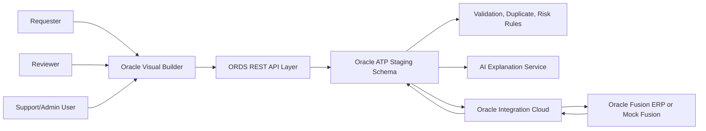
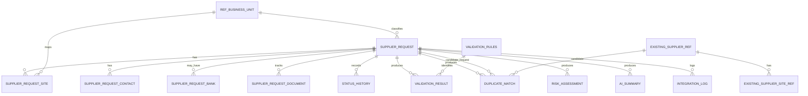

# Technical Design

## Document Status

- **Project**: Supplier Onboarding, Duplicate Detection, and Risk Scoring
- **Phase**: AI-DLC Inception / Application Design
- **Status**: Complete consolidated baseline for proposal, schema, and first-pass wireframe review; final implementation design depends on customer tenancy, security, and Fusion API validation
- **Wireframes**: First-pass specification and clickable mockup are complete and awaiting approval before construction-stage design

## 1. Executive Technical Summary

The solution is a staged supplier onboarding application. Visual Builder provides the user experience, ORDS exposes controlled REST APIs over ATP, ATP stores workflow and rule outputs, OIC integrates with Oracle Fusion ERP, and Fusion remains the supplier master system of record.

Core design principle: the UI never creates suppliers directly in Fusion. Supplier data is first staged, validated, duplicate-checked, risk-scored, reviewed, and only then submitted to Fusion through OIC.

## 2. Architecture



Text alternative: users work in Visual Builder. Visual Builder calls ORDS. ORDS reads and writes ATP. ATP stores requests, validations, duplicate results, risk results, AI summaries, reference data, and integration logs. OIC reads approved requests from ATP/ORDS, creates suppliers in Fusion or mock Fusion, and writes the result back to ATP.

## 3. Logical Components

| Component | Responsibility | Notes |
|---|---|---|
| Visual Builder App | Request, review, dashboard, and support/admin screens. | Uses service connections to ORDS APIs. |
| ORDS API Layer | REST facade over ATP procedures/tables. | Enforces endpoint contracts, role checks, and error envelopes. |
| ATP Staging Schema | Source for request workflow state and audit records. | Not supplier master system of record. |
| Validation Engine | Mandatory, conditional, and business mapping validation. | Implemented in ATP PL/SQL package or service layer behind ORDS. |
| Duplicate Detection Engine | Exact/fuzzy matching against supplier reference and staged requests. | Deterministic, explainable, persisted. |
| Risk Scoring Engine | Rule-based risk scoring and risk reason generation. | Deterministic, versioned, configurable. |
| AI Explanation Service | Plain-language risk and duplicate summary. | Does not make decisions. Provider pending. |
| Review Workflow Service | Controls reviewer actions, status transitions, selected risk-factor evidence, and targeted correction guidance. | Stores a validated decision envelope in `STATUS_HISTORY.action_comment` and prevents review bypass. |
| OIC Supplier Submit Flow | Creates supplier in Fusion or mock endpoint. | Captures Fusion response and errors. |
| OIC Supplier Reference Sync Flow | Loads existing suppliers into ATP. | Real Fusion sync or mock seed data. |
| Integration Observability | Logs OIC instance, payload/response references, errors, retries. | Support/admin visible. |

## 4. Deployment and Environment Assumptions

| Area | Baseline Assumption |
|---|---|
| UI | Oracle Visual Builder web application. |
| Database | Oracle ATP with application schema for staging and rules. |
| API | ORDS module with versioned base path. |
| Integration | Oracle Integration Cloud REST/database adapters and Fusion REST APIs or mock endpoints. |
| Fusion | Oracle Fusion ERP is system of record after successful creation. |
| Identity | Customer SSO/IDCS/OCI IAM mapping to application roles, exact setup pending. |
| AI | Customer-approved AI provider or mocked AI summary for demo, exact provider pending. |
| Prototype Volume | Few hundred supplier reference rows and 50-100 supplier requests. |

## 5. Persona-Based Access Model

| Capability | Requester | Reviewer | Support/Admin |
|---|---:|---:|---:|
| Create draft request | Yes | No | Optional support only |
| Submit own request | Yes | No | Optional support only |
| View own request status | Yes | No | Yes |
| View review queue | No | Yes | Yes |
| View duplicate outcome/details | Outcome/reference for own request only | Yes | Yes |
| View persisted risk assessment | No | Yes | Yes |
| Approve/reject/request correction/mark duplicate | No | Yes | No by default |
| View integration logs | No | Limited business status only | Yes |
| Retry integration failures | No | No | Yes |
| Maintain Admin Settings controls | No | No | Yes |

## 6. Request Status Model

| Status | Entry Trigger | Allowed Next Statuses | Notes |
|---|---|---|---|
| Draft | Request created/saved | Submitted | Not visible in review queue. |
| Submitted | A submit/resubmit attempt passes all blocking validation | Under Review | Recorded as an auditable transition immediately before Under Review; failed attempts never enter Submitted. |
| Under Review | Validation complete or warnings only | Approved, Rejected, Correction Requested, Marked Duplicate | Reviewer decision required. |
| Correction Requested | Reviewer requests correction | Submitted | Requester edits and resubmits. |
| Approved | Reviewer approves | Submitted to Fusion | Eligible for OIC submission. |
| Rejected | Reviewer rejects | Final for phase one | Requires comment. |
| Marked Duplicate | Reviewer confirms duplicate | Final for phase one | Requires existing supplier reference. |
| Submitted to Fusion | OIC submit started | Created in Fusion, Integration Failed | Technical/integration lifecycle. |
| Created in Fusion | Fusion/mock success | Final | Store supplier number. |
| Integration Failed | OIC/Fusion error | Submitted to Fusion after retry, Correction Requested if business mapping issue | Retry only if eligible. |

`Validation Failed` is an API/business outcome, not a persisted request status. A failed initial submit remains Draft; a failed resubmit remains Correction Requested. Findings are persisted in `VALIDATION_RESULT` and related duplicate/risk output tables, returned with HTTP 422, and kept out of the Reviewer queue.

## 7. ATP Data Model

### 7.1 Core Tables

| Table | Key Columns | Purpose |
|---|---|---|
| SUPPLIER_REQUEST | request_id, request_number, status, supplier_name, supplier_type_code, country_code, business_unit_id, requester_user, business_justification, product_service_category, expected_annual_spend, tax_registration_number, fusion_supplier_id, fusion_supplier_number, fusion_created_at, fusion_response_ref, created_at, submitted_at, last_updated_at | Header record, workflow state, and Fusion/mock Fusion success result. |
| SUPPLIER_REQUEST_SITE | site_id, request_id, site_name, country_code, address_line1, address_line2, city, region, postal_code, intended_business_unit_id, is_primary | At least one site using the committed schema shape; `site_name` may be derived from supplier name and city for the prototype. |
| SUPPLIER_REQUEST_CONTACT | contact_id, request_id, contact_name, contact_email, phone_number, email_domain | Contact data and duplicate signal source. |
| SUPPLIER_REQUEST_BANK | bank_id, request_id, bank_country_code, masked_account_display, account_last4, account_hash, bank_provided_flag | Optional bank data with masked/tokenized duplicate support. |
| SUPPLIER_REQUEST_DOCUMENT | document_id, request_id, document_type, document_status, is_required, metadata_json, missing_flag | Metadata and missing-document flags; upload optional. |
| STATUS_HISTORY | history_id, request_id, from_status, to_status, action_code, actor_user, action_comment, action_timestamp | Auditable status transitions. |

### 7.2 Rule Output Tables

| Table | Key Columns | Purpose |
|---|---|---|
| VALIDATION_RESULT | validation_id, request_id, validation_rule_id, run_id, is_current, field_name, severity, message, is_blocking, created_at | Failed business-validation results linked to their governed rule definition, including rerun/current tracking. |
| DUPLICATE_MATCH | match_id, request_id, run_id, is_current, candidate_source, candidate_supplier_ref_id, candidate_request_id, candidate_supplier_number, candidate_supplier_name, match_score, match_level, matched_fields_json, explanation, created_at | Duplicate candidates and reasons for existing suppliers and staged request candidates. |
| RISK_ASSESSMENT | risk_id, request_id, run_id, is_current, risk_score, risk_level, scoring_version, risk_reasons_json, created_at | Risk score, explainable reasons, and recalculation/current tracking. |
| AI_SUMMARY | summary_id, request_id, prompt_version, provider_name, model_name, summary_json, source_facts_hash, created_at, created_by | AI explanation history. |

### 7.3 Integration and Reference Tables

| Table | Key Columns | Purpose |
|---|---|---|
| EXISTING_SUPPLIER_REF | supplier_ref_id, fusion_supplier_id, supplier_number, supplier_name, normalized_name, country_code, tax_registration_number, email_domain, phone_normalized, address_normalized, bank_account_hash, last_sync_at | Duplicate reference data from Fusion/mock. |
| EXISTING_SUPPLIER_SITE_REF | site_ref_id, supplier_ref_id, fusion_site_id, site_name, country_code, address_normalized, business_unit_code | Supplier site reference data. |
| INTEGRATION_LOG | log_id, request_id, integration_name, oic_instance_id, direction, status, error_category, payload_ref, response_ref, user_message, technical_message, retry_count, retry_eligible_flag, last_retry_at, last_retry_by, retry_history_json, created_at | Request-scoped OIC/Fusion observability, searchable retry summary, and embedded append-only retry audit history. |
| VALIDATION_RULES | validation_rule_id, rule_code, rule_name, rule_description, field_name, severity, default_message, is_blocking, active_flag, created_at, created_by, updated_at, updated_by | Governed catalog for Section 9.1 blocking validations and global active/inactive settings. |
| REF_BUSINESS_UNIT | business_unit_id, business_unit_code, business_unit_name, fusion_mapping_code, active_flag | Business unit lookup/mapping. |
| REF_SUPPLIER_TYPE | supplier_type_id, supplier_type_code, supplier_type_name, tax_required_flag, active_flag | Supplier type lookup. |
| REF_HIGH_RISK_COUNTRY | country_code, country_name, risk_level, active_flag, effective_from, effective_to | Configurable country risk. |
| REF_SCORING_RULE | rule_code, version, rule_type, rule_name, weight, severity, critical_trigger_flag, active_flag, created_at, created_by, updated_at, updated_by | Consolidated risk and duplicate scoring configuration; `rule_type` is `RISK` or `DUPLICATE`. |

### 7.4 Data Relationship Model



Text alternative: `SUPPLIER_REQUEST` is the parent entity for the request workflow. Child records capture sites, contacts, optional bank/document metadata, status history, validation outputs, duplicate matches, automatic risk assessments, AI summaries, and request-scoped integration logs. Reviewer factor selections and targeted correction guidance are serialized in the status-history decision comment rather than separate tables. Each integration log embeds its append-only retry audit history in `retry_history_json`. Every `VALIDATION_RESULT` points to the `VALIDATION_RULES` entry that failed. Reference tables provide business-unit, supplier-type, high-risk-country, and consolidated risk/duplicate scoring configuration. Existing supplier reference tables and staged requests provide the candidate records used by duplicate detection.

### 7.5 Database Schema Design Detail

The following schema design is sufficient for wireframes, API contracts, and prototype DDL generation. Physical names may be adjusted to match the customer's database naming standards during implementation.

| Table | Primary Key | Foreign Keys / Relationships | Required Constraints and Indexes |
|---|---|---|---|
| SUPPLIER_REQUEST | request_id | business_unit_id -> REF_BUSINESS_UNIT.business_unit_id; supplier_type_code -> REF_SUPPLIER_TYPE.supplier_type_code | Unique request_number; index status, requester_user, country_code, business_unit_id, supplier_type_code, submitted_at, fusion_supplier_number; check expected_annual_spend >= 0; status constrained to approved status list. |
| SUPPLIER_REQUEST_SITE | site_id | request_id -> SUPPLIER_REQUEST.request_id; intended_business_unit_id -> REF_BUSINESS_UNIT.business_unit_id | Index request_id; submitted requests require address_line1, address_line2, city, region, and country_code; ORDS/application validation limits both address lines to 20 characters; one primary site per request by filtered/functional unique rule where supported. |
| SUPPLIER_REQUEST_CONTACT | contact_id | request_id -> SUPPLIER_REQUEST.request_id | Index request_id and email_domain; validate contact_email format in service/rule layer; normalize email_domain for matching. |
| SUPPLIER_REQUEST_BANK | bank_id | request_id -> SUPPLIER_REQUEST.request_id | Index request_id and account_hash; never store unmasked account number; account_hash nullable when bank data is not provided. |
| SUPPLIER_REQUEST_DOCUMENT | document_id | request_id -> SUPPLIER_REQUEST.request_id | Index request_id, document_type, missing_flag; metadata_json stores document metadata only for phase one. |
| STATUS_HISTORY | history_id | request_id -> SUPPLIER_REQUEST.request_id | Index request_id and action_timestamp; action_comment required for reject, correction, and duplicate decisions. |
| VALIDATION_RESULT | validation_id | request_id -> SUPPLIER_REQUEST.request_id; validation_rule_id -> VALIDATION_RULES.validation_rule_id | Require validation_rule_id; index request_id, validation_rule_id, run_id, is_current, and is_blocking; run_id/is_current allow validation reruns after correction while preserving history. |
| DUPLICATE_MATCH | match_id | request_id -> SUPPLIER_REQUEST.request_id; candidate_supplier_ref_id -> EXISTING_SUPPLIER_REF.supplier_ref_id where candidate is existing supplier; candidate_request_id -> SUPPLIER_REQUEST.request_id where candidate is staged request | Index request_id, run_id, is_current, candidate_source, candidate_supplier_ref_id, candidate_request_id, match_level, match_score; matched_fields_json stores explainable signal details. |
| RISK_ASSESSMENT | risk_id | request_id -> SUPPLIER_REQUEST.request_id | Index request_id, run_id, is_current, risk_level, created_at; risk_reasons_json stores factor-level reasons and weights. |
| AI_SUMMARY | summary_id | request_id -> SUPPLIER_REQUEST.request_id | Index request_id, prompt_version, created_at; source_facts_hash supports traceability to the risk/duplicate facts used. |
| EXISTING_SUPPLIER_REF | supplier_ref_id | None | Unique supplier_number where available; index normalized_name, country_code, tax_registration_number, email_domain, bank_account_hash. |
| EXISTING_SUPPLIER_SITE_REF | site_ref_id | supplier_ref_id -> EXISTING_SUPPLIER_REF.supplier_ref_id | Index supplier_ref_id, country_code, business_unit_code, address_normalized. |
| INTEGRATION_LOG | log_id | Required request_id -> SUPPLIER_REQUEST.request_id | Index request_id, integration_name, status, error_category, oic_instance_id, retry_eligible_flag, and created_at; initialize `retry_history_json` to `[]` and `retry_count` to `0` in the service because DBML does not define a retry-count default; payload/response values should be references, not raw sensitive payloads. |
| VALIDATION_RULES | validation_rule_id | None | Unique rule_code; seed exactly VAL-001 through VAL-009 from Section 9.1; index active_flag, severity, and is_blocking; include created/updated audit fields. |
| REF_BUSINESS_UNIT | business_unit_id | None | Unique business_unit_code; index fusion_mapping_code and active_flag; fusion_mapping_code required for active values used in Fusion payloads; include created/updated audit fields. |
| REF_SUPPLIER_TYPE | supplier_type_id | None | Unique supplier_type_code; index active_flag; tax_required_flag drives validation rules; include created/updated audit fields. |
| REF_HIGH_RISK_COUNTRY | country_code, effective_from | None | Standalone manual reference table; index active_flag and effective dates; overlapping active ranges should be prevented by rule/data load control; include created/updated audit fields. |
| REF_SCORING_RULE | rule_type, rule_code, version | None | Require rule_type in `RISK`, `DUPLICATE`; composite key preserves rule-code/version identity within each domain; index rule_type, active_flag, severity, and critical_trigger_flag; weight numeric and non-negative; risk rules use severity and duplicate rules use critical_trigger_flag; include created/updated audit fields. |

### 7.6 Schema Implementation Notes

- Use generated numeric identities or UUIDs for technical primary keys, depending on customer ATP standards.
- Use UTC timestamps for audit fields and display localized values in Visual Builder.
- Store JSON details in `*_json` fields only for naturally variable structures such as matched duplicate fields, risk reasons, and the retry-attempt audit array.
- Keep normalized duplicate-search fields separate from original display values.
- Apply soft deactivation to reference data through `active_flag`; do not delete reference rows used by historical requests.
- Treat `VALIDATION_RULES.rule_code` as a stable business identifier and retain `VALIDATION_RESULT.validation_rule_id` as the required physical reference to the exact failed rule.
- Keep risk and duplicate rule codes unique by `rule_type`, `rule_code`, and `version` in `REF_SCORING_RULE`; use `rule_type` rather than separate tables to select the appropriate scoring engine configuration.
- Use database constraints for structural integrity and service-layer rules for conditional business validation.
- Keep full bank account values out of ATP unless the customer explicitly approves secure encrypted storage; the prototype baseline stores masked display and hash/token values only.
- Store Fusion/mock Fusion supplier identifiers directly on `SUPPLIER_REQUEST` so requester dashboards and status details can show the created supplier number without parsing integration logs.
- Use `run_id` and `is_current` on validation, duplicate, and risk output tables so corrections can trigger reruns while preserving historical evidence.
- Store selected Reviewer factor codes and targeted correction items only when a decision is recorded, inside the validated `STATUS_HISTORY.action_comment` decision envelope. Do not mutate the automatic `RISK_ASSESSMENT`.
- Keep `INTEGRATION_LOG` request-scoped as defined by DBML. Use required `request_id` plus `oic_instance_id` for troubleshooting and idempotency; keep global supplier-sync execution logs in OIC monitoring.
- Keep retry attempts in the append-only `INTEGRATION_LOG.retry_history_json` array. Append the history entry and update `retry_count`, `last_retry_at`, and `last_retry_by` atomically; `retry_count` must equal the array length.
- Treat [database-schema-design.md](database-schema-design.md) as the authoritative reviewed ATP schema design.
- Keep `aidlc-docs/inception/application-design/db-schema.dbml` synchronized as its implementation-ready, machine-readable physical equivalent.

### 7.7 Embedded Retry History Contract

`INTEGRATION_LOG.retry_history_json` is initialized to an empty array and stores entries in attempt order:

```json
[
  {
    "attemptNumber": 1,
    "actorUser": "support.admin@example.com",
    "attemptedAt": "2026-07-20T16:30:00Z",
    "result": "FAILED",
    "message": "Fusion endpoint timeout.",
    "oicInstanceId": "OIC-RETRY-0001"
  }
]
```

Each object requires all six fields. Existing entries are never updated or removed. The `message` value follows the same redaction policy as other integration diagnostics and must not contain raw sensitive payload data. After OIC returns or calls back, one short ATP transaction locks the originating log row, appends one object, increments `retry_count`, sets `last_retry_at` and `last_retry_by`, and updates the current integration outcome. No database transaction remains open across the OIC/Fusion network call. The summary fields support filtering without querying JSON, while the array supplies the full support/audit timeline.

### 7.8 Status-History Decision Evidence Contract

`STATUS_HISTORY.action_comment` stores a service-validated JSON string for Reviewer decisions. This uses the committed text column and adds no table or column:

```json
{
  "schemaVersion": 1,
  "comment": "Please provide a valid tax registration or explain why it is not applicable.",
  "selectedRiskFactorCodes": ["MISSING_TAX", "VAGUE_JUSTIFICATION"],
  "correctionItems": [
    {
      "itemType": "FIELD",
      "fieldName": "taxRegistrationNumber",
      "itemCode": "MISSING_TAX",
      "instruction": "Provide the tax registration or a business-safe exemption reason."
    }
  ],
  "existingSupplierNumber": null
}
```

The envelope is written atomically with the status transition. `schemaVersion` is required so later readers can evolve safely. `actor_user` and `action_timestamp` identify who decided and when. `selectedRiskFactorCodes` are decision evidence and never change the stored risk score. `correctionItems` are required only for Request Correction. `existingSupplierNumber` is required only for Mark Duplicate. ORDS validates allowed factor/item codes, field-name allowlists, collection limits, and string lengths before serialization. It exposes only `comment` plus `correctionItems` to the Requester; Reviewer-only factor selections remain hidden. Historical status rows preserve prior guidance, while a successful resubmission makes the previous correction action no longer current without deleting it. Non-decision history actions may continue to use a plain business-safe comment; parsers branch on `action_code` and fail safely if a decision envelope is malformed.

### 7.9 Integration Identity Contract

Every ATP `INTEGRATION_LOG` belongs to one `SUPPLIER_REQUEST`. The stable troubleshooting tuple is `request_id`, `log_id`, and `oic_instance_id` where OIC supplies one. Retry entries record their own OIC instance ID inside `retry_history_json`. Supplier-reference synchronization has no supplier-request parent, so it does not create an ATP `INTEGRATION_LOG`; OIC monitoring provides the global run status and instance identifier, while synchronized supplier rows record `last_sync_at`.

## 8. ORDS API Design

### 8.1 API Base

Recommended base path:

```text
/ords/erp/supplier-onboarding/v1
```

### 8.2 Response Envelope

Successful response:

```json
{
  "success": true,
  "data": {},
  "messages": [],
  "traceId": "ords-7f09c2a8"
}
```

Error response:

```json
{
  "success": false,
  "error": {
    "category": "BUSINESS_VALIDATION",
    "code": "SUPPLIER_NAME_REQUIRED",
    "message": "Supplier name is required.",
    "technicalMessage": null,
    "retryEligible": false
  },
  "traceId": "ords-7f09c2a8"
}
```

`traceId` is transient ORDS observability metadata and is not an ATP schema column.

### 8.3 HTTP Status Guidance

| HTTP Status | Use |
|---:|---|
| 200 | Successful read/action. |
| 201 | Request created. |
| 400 | Invalid request payload or business validation issue. |
| 401 | Unauthenticated. |
| 403 | Authenticated but not authorized for action. |
| 404 | Request/resource not found. |
| 409 | Invalid status transition or duplicate conflict. |
| 422 | Semantically valid payload but rule validation failed. |
| 500 | Unexpected server error. |
| 502/504 | Downstream OIC/Fusion timeout or gateway failure where exposed through ORDS. |

### 8.4 Endpoint Catalog

| Method | Endpoint | Roles | Purpose |
|---|---|---|---|
| POST | `/requests` | Requester | Create draft request. |
| GET | `/requests` | Requester, Reviewer, Support/Admin | List requests with role-aware scope and filters. |
| GET | `/requests/{requestId}` | Requester owner, Reviewer, Support/Admin | Retrieve role-aware request detail; Requester projection excludes persisted risk assessment. |
| PATCH | `/requests/{requestId}` | Requester owner | Update Draft or Correction Requested request. |
| POST | `/requests/{requestId}/submit` | Requester owner | Attempt submit/resubmit; on blocking findings return HTTP 422 and preserve Draft/Correction Requested, otherwise atomically transition through Submitted to Under Review. |
| POST | `/requests/{requestId}/validate` | Reviewer, Support/Admin, System | Run validation. |
| GET | `/requests/{requestId}/validation-results` | Requester owner, Reviewer, Support/Admin | Retrieve validation findings. |
| POST | `/requests/{requestId}/duplicate-check` | Reviewer, Support/Admin, System | Run persisted duplicate check; submit/resubmit orchestration invokes this automatically. |
| GET | `/requests/{requestId}/duplicate-matches` | Reviewer, Support/Admin | Retrieve persisted duplicate matches; Requesters receive only safe blocker text or the final existing-supplier reference through request detail. |
| POST | `/requests/{requestId}/risk-score` | Reviewer, Support/Admin, System | Calculate risk. |
| GET | `/requests/{requestId}/risk-assessment` | Reviewer, Support/Admin | Retrieve the latest persisted risk assessment without recalculating it. |
| POST | `/requests/{requestId}/ai-summary` | Reviewer, Support/Admin | Generate/regenerate AI summary. |
| GET | `/requests/{requestId}/ai-summaries` | Reviewer, Support/Admin | Retrieve AI summary history. |
| GET | `/requests/{requestId}/attachments` | Requester owner, Reviewer, Support/Admin | Retrieve document metadata/missing flags. |
| POST | `/requests/{requestId}/attachment-metadata` | Requester owner | Add/update document metadata. |
| POST | `/requests/{requestId}/approve` | Reviewer | Approve for Fusion submission. |
| POST | `/requests/{requestId}/reject` | Reviewer | Reject with comment. |
| POST | `/requests/{requestId}/request-correction` | Reviewer | Return to requester and atomically store comment, selected factor codes, and structured correction items in the new status-history action. |
| POST | `/requests/{requestId}/mark-duplicate` | Reviewer | Close as duplicate with existing supplier reference. |
| POST | `/requests/{requestId}/submit-to-fusion` | System, Support/Admin | Trigger OIC submission or mark as pending submission. |
| POST | `/integration-logs/{logId}/retry` | Support/Admin | Retry the eligible failure represented by the specified request-scoped log; verify its request/status and atomically append the completed attempt. |
| GET | `/dashboard/requester-summary` | Requester | Requester dashboard counts. |
| GET | `/dashboard/reviewer-summary` | Reviewer | Reviewer queue counts. |
| GET | `/dashboard/support-summary` | Support/Admin | Integration/support counts. |
| GET | `/integration-logs` | Support/Admin | Search request-scoped integration logs by request ID, OIC instance ID, status, error category, and retry eligibility. |
| GET | `/integration-logs/{logId}` | Support/Admin | View one integration log, including its embedded retry history. |
| GET | `/reference/business-units` | All authenticated | Business unit lookup. |
| GET | `/reference/supplier-types` | All authenticated | Supplier type lookup. |
| GET | `/admin-settings/high-risk-countries` | Support/Admin | View active and inactive high-risk-country periods. |
| PUT | `/admin-settings/high-risk-countries/{countryCode}/periods/{effectiveFrom}` | Support/Admin | Maintain one `REF_HIGH_RISK_COUNTRY` composite-key period. |
| GET | `/admin-settings/validation-rules` | Support/Admin | View validation rule active/inactive configuration. |
| PUT | `/admin-settings/validation-rules/{ruleCode}` | Support/Admin | Maintain the `VALIDATION_RULES.active_flag` setting. |
| GET | `/admin-settings/scoring-rules` | Support/Admin | View consolidated scoring configuration, optionally filtered by `ruleType=RISK` or `ruleType=DUPLICATE`. |
| PUT | `/admin-settings/scoring-rules/{ruleType}/{ruleCode}/versions/{version}` | Support/Admin | Maintain an existing risk or duplicate scoring-rule version in `REF_SCORING_RULE`. |
| GET | `/admin-settings/business-units` | Support/Admin | View active and inactive business units and Fusion mappings. |
| PUT | `/admin-settings/business-units/{businessUnitCode}` | Support/Admin | Maintain business-unit mapping and active status in `REF_BUSINESS_UNIT`. |
| GET | `/admin-settings/supplier-types` | Support/Admin | View active and inactive supplier types and tax-required flags. |
| PUT | `/admin-settings/supplier-types/{supplierTypeCode}` | Support/Admin | Maintain supplier type, tax-required flag, and active status in `REF_SUPPLIER_TYPE`. |
| POST | `/admin-settings/supplier-reference-sync` | Support/Admin | Trigger the OIC supplier-reference flow and return its OIC instance ID; run status remains in OIC monitoring. |
| PUT | `/internal/supplier-references/{fusionSupplierId}` | System/OIC | Idempotently upsert one normalized `EXISTING_SUPPLIER_REF` row and its `last_sync_at`. |
| PUT | `/internal/supplier-references/{fusionSupplierId}/sites/{fusionSiteId}` | System/OIC | Idempotently upsert one `EXISTING_SUPPLIER_SITE_REF` row. |
| POST | `/internal/requests/{requestId}/integration-results` | System/OIC | Record request-scoped OIC/Fusion success or failure, supplier identifiers, safe diagnostics, and an `INTEGRATION_LOG` row. |

#### Requester Response Projection

For a Requester owner call to `GET /requests/{requestId}`, the response may contain the current status, status timeline, business-safe Reviewer comments, current targeted correction items parsed from the latest Correction Requested history action, required next action, final existing-supplier reference when marked duplicate, business-safe integration outcome, and Fusion supplier number after successful creation.

The Requester projection must omit `riskScore`, `riskLevel`, risk reasons/factors, scoring version, AI summaries, and reviewer-only evidence. Reviewer and Support/Admin clients retrieve the persisted assessment through `GET /requests/{requestId}/risk-assessment`. Server-side AI explanation orchestration may read the stored assessment through the internal risk service or ATP data access without granting Requester access to that endpoint.

### 8.5 Representative Request Payload

```json
{
  "supplierName": "ABC Technologies Ltd.",
  "supplierType": "SERVICE_PROVIDER",
  "countryCode": "GB",
  "businessUnitCode": "BU-001",
  "contact": {
    "name": "Sarah Jones",
    "email": "sarah.jones@example.com",
    "phone": "+44 20 5555 0101"
  },
  "site": {
    "addressLine1": "Office 12",
    "addressLine2": "4 King Street",
    "city": "London",
    "region": "Greater London",
    "countryCode": "GB",
    "postalCode": "SW1A 1AA"
  },
  "businessJustification": "Needed for facilities maintenance services for the London operations site.",
  "productServiceCategory": "Facilities Services",
  "expectedAnnualSpend": 75000,
  "taxRegistrationNumber": "GB123456789",
  "bank": {
    "bankCountryCode": "GB",
    "accountLast4": "1234",
    "accountToken": "hash-or-token-generated-client-or-server-side"
  },
  "documents": [
    {
      "documentType": "TAX_CERTIFICATE",
      "documentStatus": "PENDING"
    }
  ]
}
```

### 8.6 UI/API-to-ATP Field Mapping

| UI / API Field | Authoritative ATP Target | Mapping Rule |
|---|---|---|
| `supplierName` | `SUPPLIER_REQUEST.supplier_name` | Preserve display value; normalization for matching is calculated separately. |
| `supplierType` | `SUPPLIER_REQUEST.supplier_type_code` | Validate against active `REF_SUPPLIER_TYPE.supplier_type_code`. |
| Header `countryCode` | `SUPPLIER_REQUEST.country_code` | Store the supplier country independently from the site country. |
| `businessUnitCode` | `SUPPLIER_REQUEST.business_unit_id` | Resolve active code to `REF_BUSINESS_UNIT.business_unit_id`; VAL-004 requires a valid Fusion mapping. |
| `businessJustification` | `SUPPLIER_REQUEST.business_justification` | Apply length and content validation; may feed deterministic/AI vague-justification review. |
| `productServiceCategory` | `SUPPLIER_REQUEST.product_service_category` | Store the selected business category. |
| `expectedAnnualSpend` | `SUPPLIER_REQUEST.expected_annual_spend` | Parse as non-negative decimal. |
| `taxRegistrationNumber` | `SUPPLIER_REQUEST.tax_registration_number` | Normalize only for duplicate comparison; retain the submitted display value. |
| Contact name/email/phone | `SUPPLIER_REQUEST_CONTACT.contact_name`, `contact_email`, `phone_number` | Derive lowercase `email_domain`; normalize phone separately for comparisons. |
| Site address lines | `SUPPLIER_REQUEST_SITE.address_line1`, `address_line2` | Enforce 20-character maximum in ORDS/application validation; street/area text stays inside these fields. |
| Site city/region/country/postal | `SUPPLIER_REQUEST_SITE.city`, `region`, `country_code`, `postal_code` | Postal code is optional where not applicable; `site_name` may be derived from supplier name plus city. |
| Site business unit | `SUPPLIER_REQUEST_SITE.intended_business_unit_id` | Default from the header BU for phase one, then resolve to `REF_BUSINESS_UNIT.business_unit_id`. |
| Bank provided/country/masked value | `SUPPLIER_REQUEST_BANK.bank_provided_flag`, `bank_country_code`, `masked_account_display`, `account_last4` | Never persist a full account number. |
| Bank token | `SUPPLIER_REQUEST_BANK.account_hash` | Accept only a trusted token/hash from the approved tokenization boundary; use for duplicate comparison. |
| Document metadata | `SUPPLIER_REQUEST_DOCUMENT.document_type`, `document_status`, `is_required`, `metadata_json`, `missing_flag` | Store metadata and flags only; no phase-one file content. |
| Review decision | `SUPPLIER_REQUEST.status` plus `STATUS_HISTORY` | Atomically update status and append `action_code`, actor/time, and the Section 7.8 decision envelope in `action_comment`. |
| Validation/duplicate/risk/AI outputs | `VALIDATION_RESULT`, `DUPLICATE_MATCH`, `RISK_ASSESSMENT`, `AI_SUMMARY` | Server-generated only; clients cannot write calculated scores directly. |
| Fusion/OIC outcome | `SUPPLIER_REQUEST` Fusion result columns plus `INTEGRATION_LOG` | OIC/system callback records request-scoped outcome; global reference sync does not use `INTEGRATION_LOG`. |

## 9. Validation Design

### 9.1 Blocking Validations

| Rule | Description | Failure Status |
|---|---|---|
| VAL-001 | Supplier name required. | Block submit; keep editable status |
| VAL-002 | Country required. | Block submit; keep editable status |
| VAL-003 | Supplier type required. | Block submit; keep editable status |
| VAL-004 | Business unit required and mapped. | Block submit; keep editable status |
| VAL-005 | Contact email required and valid. | Block submit; keep editable status |
| VAL-006 | Required site fields are complete: Address Line 1, Address Line 2, city, region/province/state, and address country; street/area belongs inside the address lines. ORDS/application validation limits each address line to 20 characters. | Block submit; keep editable status |
| VAL-007 | At least one supplier site required for phase-one baseline. | Block submit; keep editable status |
| VAL-008 | Exact tax registration duplicate found in existing supplier reference data or relevant staged requests. | Block submit; keep editable status |
| VAL-009 | Same bank token/hash duplicate found when bank data is captured. | Block submit; keep editable status |

These nine definitions are seeded in `VALIDATION_RULES`. `validation_rule_id` is the technical primary key, `rule_code` is the stable unique business identifier, and `active_flag` supplies the global Admin Settings switch. A failed evaluation writes `VALIDATION_RESULT.validation_rule_id` so the exact governed definition is traceable without duplicating the rule code in the result row.

Tax registration is not globally mandatory. `REF_SUPPLIER_TYPE.tax_required_flag`, the request country, and the phase-one validation-service country policy determine whether the form presents tax as required. Missing tax is represented by the configured `MISSING_TAX` risk rule unless the customer explicitly promotes it to a blocking validation policy. The committed nine-rule baseline does not invent a separate tax-policy table.

### 9.2 Risk Warning Factors

| Rule Code | Description | Governing Table |
|---|---|---|
| `MISSING_TAX` | Tax registration is missing when expected for supplier type/country but is not configured as a hard block. | `REF_SCORING_RULE`, `rule_type = RISK` |
| `HIGH_RISK_COUNTRY` | Request country has an active warning period in `REF_HIGH_RISK_COUNTRY`. | `REF_SCORING_RULE`, `rule_type = RISK` |
| `BANK_COUNTRY_MISMATCH` | Captured bank country differs from supplier country. | `REF_SCORING_RULE`, `rule_type = RISK` |
| `INCOMPLETE_ADDRESS` | Submitted address is present but remains suspicious or incomplete for manual review. | `REF_SCORING_RULE`, `rule_type = RISK` |
| `INCOMPLETE_BANK_DETAILS` | Bank data is marked provided but its masked/tokenized metadata is incomplete. | `REF_SCORING_RULE`, `rule_type = RISK` |
| `VAGUE_JUSTIFICATION` | Business justification appears vague. | `REF_SCORING_RULE`, `rule_type = RISK` |
| `HIGH_SPEND_WEAK_JUSTIFICATION` | Expected annual spend is high and justification is weak. | `REF_SCORING_RULE`, `rule_type = RISK` |
| `MISSING_DOCUMENT_METADATA` | Required document metadata indicates a missing document. | `REF_SCORING_RULE`, `rule_type = RISK` |
| `DUPLICATE_SCORE_HIGH` | Current duplicate result is High. | `REF_SCORING_RULE`, `rule_type = RISK` |
| `DUPLICATE_SCORE_MEDIUM` | Current duplicate result is Medium. | `REF_SCORING_RULE`, `rule_type = RISK` |

These are scoring factors, not `VALIDATION_RULES` rows. Their weights, severities, and active/inactive states are maintained through `REF_SCORING_RULE`.

## 10. Duplicate Detection Design

### 10.1 Execution Points

- Mandatory: automatically during submit/resubmit validation and before approval.
- No requester-triggered duplicate-check button or standalone requester warning endpoint is included in phase one.
- Re-run: after correction or material field change.

### 10.2 Normalization

| Field | Normalization |
|---|---|
| Supplier name | Uppercase, trim, remove punctuation, remove common legal suffixes, collapse spaces. |
| Tax registration | Uppercase, remove spaces/punctuation. |
| Email | Extract lowercase domain. |
| Phone | Normalize digits and country prefix where feasible. |
| Address | Uppercase, remove punctuation, normalize abbreviations where feasible. |
| Bank account | Use account hash/token; display only masked/last-four value. |

### 10.3 Scoring Baseline

| Rule Code | Signal | Weight / Effect |
|---|---|---:|
| `DUP_EXACT_TAX` | Exact tax registration match | Blocking signal consumed by VAL-008 |
| `DUP_SAME_BANK` | Same bank account token/hash | Blocking signal consumed by VAL-009 |
| `DUP_NAME_SIMILARITY` | Strong normalized name similarity | 30 |
| `DUP_SAME_COUNTRY` | Same country | 10 |
| `DUP_EMAIL_DOMAIN` | Same email domain | 15 |
| `DUP_PHONE` | Same phone | 20 |
| `DUP_ADDRESS` | Address similarity | 20 |
| `DUP_BU_SITE` | Same business unit/site context | 5 |

### 10.4 Levels

| Level | Criteria |
|---|---|
| Critical | Exact tax registration match or same bank token/hash; surfaced as blocking validation before requester submission completes. |
| High | Score >= 70 without a blocking duplicate validation trigger. |
| Medium | Score 40-69. |
| Low | Score < 40. |

Duplicate thresholds and weights are stored in versioned `REF_SCORING_RULE` rows where `rule_type = DUPLICATE`; threshold rows use stable codes such as `DUP_HIGH_THRESHOLD` and `DUP_MEDIUM_THRESHOLD`, with the numeric threshold in `weight`. The active duplicate rule controls signal/scoring participation; the independent `VAL-008` or `VAL-009` active flag controls whether its corresponding exact signal blocks submission.

## 11. Risk Scoring Design

### 11.1 Risk Factors

| Factor | Weight / Effect |
|---|---:|
| Missing tax registration | +25 |
| High-risk country | +25 |
| Bank country differs from supplier country | +20 |
| Incomplete address | +15 |
| Incomplete bank metadata when bank data is marked provided | +15 |
| Vague business justification | +15 |
| High expected spend with weak justification | +20 |
| Missing required document metadata | +10 |
| Duplicate score High | +25 |
| Duplicate score Medium | +15 |

### 11.2 Risk Levels

| Level | Criteria |
|---|---|
| Critical | Reserved for configured critical risk policy; phase-one exact tax and same bank critical duplicate triggers are handled as blocking validation before requester submission completes. |
| High | Score >= 70. |
| Medium | Score 35-69. |
| Low | Score < 35. |

Versioned `REF_SCORING_RULE` rows with `rule_type = RISK` and stable codes such as `RISK_HIGH_THRESHOLD` and `RISK_MEDIUM_THRESHOLD` store the numeric level boundaries in `weight`. Threshold rows are configuration, not Reviewer-selectable factors.

### 11.3 Risk Output

```json
{
  "riskScore": 55,
  "riskLevel": "Medium",
  "scoringVersion": "v1",
  "reasons": [
    {
      "code": "MISSING_TAX",
      "severity": "Warning",
      "message": "Tax registration is missing for this supplier type/country."
    },
    {
      "code": "BANK_COUNTRY_MISMATCH",
      "severity": "Warning",
      "message": "Bank country differs from supplier country."
    }
  ]
}
```

Visibility: the persisted risk score, level, scoring version, and factor-level reasons are available to Reviewer and Support/Admin roles only. Requesters receive status and actionable guidance through the role-aware request-detail response.

Reviewer checkbox selections remain UI decision state until the Reviewer records approve, reject, request correction, or mark duplicate. The selected factor codes are then stored in the Section 7.8 status-history decision envelope and do not change the automatic score. If the request changes, risk is recalculated and the Reviewer makes a fresh selection for the later decision.

## 12. AI Explanation Design

### 12.1 AI Responsibilities

AI may:
- Summarize risk.
- Explain duplicate reasons.
- List missing information in plain business language.
- Recommend reviewer actions.

AI must not:
- Approve a request.
- Reject a request.
- Mark a request duplicate.
- Create or submit supplier to Fusion.
- Receive unnecessary sensitive bank values.

### 12.2 AI Input Facts

AI input should be a curated facts payload:

```json
{
  "requestId": 12345,
  "supplierName": "ABC Technologies Ltd.",
  "countryCode": "GB",
  "supplierType": "SERVICE_PROVIDER",
  "businessUnit": "BU-001",
  "businessJustification": "Needed for project",
  "validationFindings": [
    "Tax registration missing"
  ],
  "duplicateFindings": [
    "Similar supplier name found in same country",
    "Same email domain found"
  ],
  "riskFindings": [
    "Vague justification",
    "High expected annual spend"
  ],
  "bankIndicators": {
    "bankCountryMismatch": false,
    "bankAccountDuplicateTokenMatch": false
  }
}
```

### 12.3 AI Output Schema

```json
{
  "riskLevel": "Medium",
  "riskSummary": "Medium risk due to missing tax registration and vague business justification.",
  "duplicateExplanation": "A possible duplicate exists because a supplier with a similar normalized name exists in the same country.",
  "missingInformation": [
    "Tax registration number",
    "More specific business justification"
  ],
  "recommendedActions": [
    "Request tax certificate",
    "Ask requester to clarify project or contract need"
  ],
  "decisionGuardrail": "AI recommendation only. Reviewer must make final decision."
}
```

### 12.4 Prompt Governance

- Store prompt version and output timestamp.
- Avoid storing full sensitive prompts if they include regulated values.
- Store source facts hash/reference for audit.
- Allow regeneration when request data changes.
- Do not persist helpful/not-helpful feedback or expose an AI-summary feedback API in this baseline.

## 13. OIC Integration Design

### 13.1 Flow A: Existing Supplier Reference Sync

Purpose: keep ATP reference data populated for duplicate detection.

Trigger options:
- Scheduled OIC integration.
- Manual support/admin trigger.
- Mock seed load for prototype.

Steps:
1. Query Fusion supplier APIs or mock data source.
2. Transform supplier records into ATP reference shape.
3. Normalize supplier name, tax ID, email domain, phone, address, and bank token where available.
4. Upsert `EXISTING_SUPPLIER_REF` and `EXISTING_SUPPLIER_SITE_REF`.
5. Record success/failure in OIC monitoring under the OIC integration instance ID; update synchronized supplier/site rows and `last_sync_at`. Do not write a requestless ATP `INTEGRATION_LOG` row.

### 13.2 Flow B: Submit Approved Supplier

Purpose: create supplier in Fusion or realistic mock after human approval.

Steps:
1. Receive request ID from ORDS/support action or scheduled polling for Approved requests.
2. Read request, site, contact, bank indicators, and validation/risk state.
3. Verify status is Approved and request is not Rejected/Marked Duplicate.
4. Build Fusion supplier payload.
5. Call Fusion supplier create endpoint or mock endpoint.
6. Create site if included and supported.
7. Store Fusion supplier number and response reference.
8. Update request to Created in Fusion or Integration Failed.
9. Write OIC instance ID, payload reference, response reference, error, and retry count.

### 13.3 Flow C: Retry Failed Integration

Purpose: allow support/admin to retry eligible failures.

Rules:
- Retry allowed for technical timeout, temporary Fusion outage, corrected mapping failure, or other retry-eligible error.
- Retry not allowed for Rejected or Marked Duplicate requests.
- Retry must not create a second supplier if Fusion already created one. Use request status, stored Fusion supplier identifiers, request ID, and OIC/Fusion idempotency support where available.
- Each attempt appends an immutable object to `INTEGRATION_LOG.retry_history_json`; the object includes attempt number, actor, timestamp, result, message, and the retry OIC instance ID.
- JSON append, retry-count increment, latest-retry summary updates, and the current integration outcome must commit or roll back together.
- The remote OIC/Fusion call is outside the ATP transaction; the returned/callback outcome is persisted in one short row-locking transaction.

## 14. Fusion REST API Candidate Mapping

These are candidate APIs to validate against the customer's Fusion release, roles, and enabled modules.

| Purpose | Candidate API |
|---|---|
| Create supplier | `POST /fscmRestApi/resources/11.13.18.05/suppliers` |
| Query suppliers | `GET /fscmRestApi/resources/11.13.18.05/suppliers` |
| Update supplier if needed later | `PATCH /fscmRestApi/resources/11.13.18.05/suppliers/{SupplierId}` |
| Create supplier contact | `POST /fscmRestApi/resources/11.13.18.05/suppliers/{SupplierId}/child/contacts` |
| Create supplier address | `POST /fscmRestApi/resources/11.13.18.05/suppliers/{SupplierId}/child/addresses` |
| Create supplier site | `POST /fscmRestApi/resources/11.13.18.05/suppliers/{SupplierId}/child/sites` |
| Query supplier sites | `GET /fscmRestApi/resources/11.13.18.05/suppliers/{SupplierId}/child/sites` |
| Supplier/site attachments, if later included | Supplier or site child `attachments` resources |
| External bank account candidate, if explicitly approved | `POST /fscmRestApi/resources/11.13.18.05/externalBankAccounts` |
| Query external bank accounts, if explicitly approved | `GET /fscmRestApi/resources/11.13.18.05/externalBankAccounts` |

Notes:
- Oracle's Suppliers resource manages supplier details and requires appropriate roles/privileges.
- Oracle's supplier site resource manages supplier sites as child resources under suppliers.
- Oracle's external bank accounts resource can create/query external bank accounts, but supplier bank account assignment and security should be confirmed separately before including it in phase one.
- Phase-one baseline excludes bank account creation in Fusion unless explicitly approved.

## 15. Error Handling

### 15.1 Error Categories

| Category | Examples | Visible To |
|---|---|---|
| BUSINESS_VALIDATION | Missing supplier name, invalid business unit, missing site. | Requester, Reviewer, Support/Admin |
| DUPLICATE_RISK | Exact tax match, high duplicate score, same bank token. | Reviewer, Support/Admin; summarized to Requester if marked duplicate |
| RISK_WARNING | High-risk country, bank mismatch, vague justification. | Reviewer, Support/Admin |
| AUTHORIZATION | User not permitted for action. | Acting user |
| INTEGRATION_TECHNICAL | OIC timeout, Fusion unavailable, authentication failure. | Support/Admin; business-safe status to Reviewer/Requester |
| INTEGRATION_BUSINESS | Fusion rejects payload due to mapping or required Fusion field. | Reviewer and Support/Admin |
| SYSTEM_ERROR | Unexpected ORDS/ATP/OIC error. | Support/Admin; generic business-safe message to user |

### 15.2 Integration Log Requirements

Each ATP integration log should store:
- Required request ID.
- Integration name.
- OIC instance ID where available.
- Direction: inbound, outbound, sync, retry.
- Status.
- Payload reference, not necessarily full payload.
- Response reference, not necessarily full response.
- User-friendly message.
- Technical message.
- Retry eligibility.
- Retry count.
- Last retry actor and timestamp.
- Append-only retry history JSON using the Section 7.7 contract.
- Timestamp.

The committed table is request-scoped. Global supplier-reference synchronization is inspected in OIC monitoring and identified by its OIC integration instance ID; it does not create an ATP integration-log row.

## 16. Security Design

| Control | Design |
|---|---|
| Authentication | Use customer Oracle identity platform/SSO mapping to application roles. |
| Authorization | Enforce deny-by-default, object-level ownership, and least-privilege Requester, Reviewer, Support/Admin capabilities at ORDS/service layer; deny Requester access to persisted risk assessments and AI review evidence; allow CORS only from approved Visual Builder origins. |
| Encryption | Require ATP encryption at rest and TLS 1.2 or later for Visual Builder, ORDS, ATP, OIC, Fusion/mock, and approved AI-provider traffic. |
| API access logging | Enable ORDS access/execution logging with timestamp, transient trace ID, authenticated principal, action, status, and latency; redact supplier, bank, token, and payload values. The trace ID is operational metadata, not an ATP column. |
| Input validation | Apply schema, type, format, allowlist, string-length, collection-size, and request-size validation at ORDS; use parameterized SQL/PLSQL only. |
| Browser response hardening | Deployed Visual Builder/HTML endpoints must set CSP, HSTS, `X-Content-Type-Options`, `X-Frame-Options`, and `Referrer-Policy` through the serving platform. |
| Abuse protection | Apply ORDS throttling/rate limits to authenticated APIs and stricter limits to AI generation, retry, and administrative mutation endpoints. |
| Administrative authentication | Require customer SSO policy and MFA for Support/Admin accounts; credentials and Fusion/AI secrets remain in managed connection/secret stores. |
| Bank data masking | Display last four digits only where needed. |
| Bank duplicate matching | Use token/hash, not plain account number, where possible. |
| AI data minimization | Send curated facts only, no full bank account number. |
| Payload protection | Payload/response references visible to support/admin only; redact sensitive values. |
| Fusion credentials | Store in OIC connection/secret management, not in Visual Builder. |
| Audit | Persist status history with decision-envelope evidence, AI summaries, Admin Settings audit columns, and retry attempts with actor/time plus request/log/OIC identifiers. Audit records are append-only or versioned and retained according to customer policy, with 90 days as the minimum production baseline until a stricter policy is provided. |
| Fail-safe errors | Authorization, validation, integration, JSON-append, and audit-write failures fail closed and roll back the action; business users receive safe errors while Support/Admin receives redacted diagnostics. |

## 17. Non-Functional Design Notes

### Performance

Prototype target is few hundred supplier references and 50-100 requests. Indexes should be added on normalized name, tax registration, country, email domain, request status, risk level, and duplicate level.

### Reliability

OIC failures should not lose request state. Integration submission should be idempotent by request ID plus stored Fusion/OIC identifiers. ORDS, OIC, Fusion/mock, and AI calls require explicit timeouts; retryable dependencies should use bounded retry with backoff and circuit-breaking where the selected Oracle runtime supports it. Non-critical AI unavailability degrades to deterministic evidence without blocking Reviewer access to validation, duplicate, and risk facts.

### Maintainability

Risk and duplicate thresholds should be seeded/configured in `REF_SCORING_RULE` and selected by `rule_type`. UI and services should consume lookup APIs instead of hardcoded values.

### Observability

Support/admin dashboard should surface request-scoped integration failures and retry history. Requester and Reviewer should see business-safe statuses. Production implementation must provide structured logs, metrics for latency/error/throughput/retry outcomes, transient ORDS trace propagation, request/OIC instance identifiers, dependency health checks, and alerts for authorization failures, integration failure rate, retry exhaustion, and backup failure.

### Resiliency Extension Posture

| Decision Area | Prototype Baseline | Production Gate |
|---|---|---|
| Workload criticality | Medium, non-production prototype demonstrating supplier onboarding value. | Customer must classify production criticality and business impact. |
| Availability, RTO, and RPO | No production SLA is claimed for the prototype. | Customer must select targets and a DR strategy before production infrastructure design. |
| Deployment topology | Customer-managed Oracle prototype tenancy. | Customer must select single-region multi-zone or an approved multi-region topology. |
| CI/CD, rollback, and change management | No deployable application artifacts exist yet. | Construction/NFR design must use the customer's named process or capture an approved alternative. |
| Backup and recovery | ATP remains the persistent request/audit store. | Production ATP automated encrypted backups, retention, and restore testing must align with the selected RPO. |
| Incident response and resiliency testing | Demo failure/retry scenarios only. | Customer process, alert routing, runbooks, and DR/game-day approach must be selected before go-live. |

These production decisions remain user/customer choices under the enabled Resiliency Baseline. They are deliberately not inferred during this documentation-only prototype amendment.

## 18. Test Strategy

| Test Area | Required Tests |
|---|---|
| Request intake | Draft, submit, structured-address completeness/20-character boundaries, correction update, and mandatory fields. |
| Role access | Requester isolation, reviewer actions, support/admin retry/reference access. |
| Validation | Missing mandatory fields, invalid email, missing site, invalid business unit. |
| Duplicate detection | Exact tax ID, fuzzy name, same bank token, email domain, address, country-only low signal. |
| Risk scoring | Missing tax, high-risk country, bank mismatch, vague justification, high spend, recalculation, active/inactive risk rules, and decision-time Reviewer factor selections that do not mutate the automatic score. |
| AI summary | Generated/mocked summary follows schema and does not decide. |
| Review workflow | Approve, reject, targeted correction in status-history decision JSON, role-safe parsing, mark duplicate, and blocked retry for duplicate/rejected. |
| OIC integration | Request-scoped ATP logs, OIC-native global sync monitoring, success, Fusion validation failure, timeout/technical failure, atomic retry-history append, and retry success. |
| Masking/security | Bank last-four display, no full bank value in AI/logs. |
| Demo data | All customer-requested demo scenarios available. |

Partial property-based testing is approved for deterministic normalization, duplicate/risk scoring invariants, payload serialization/transformations, decision-envelope parsing, and retry-history invariants. Construction-stage test design must verify normalization idempotence, score/risk-level range consistency, retry-count/history-length equality, JSON round trips, role-safe decision-envelope projection, and preservation of required request/OIC identifiers. The framework is selected when the implementation/test language is confirmed; shrinking and reproducible seed logging are mandatory.

## 19. Design Limitations and Production Hardening

- Prototype duplicate detection is explainable but not a full enterprise master-data matching platform.
- Third-party sanctions screening is not included.
- Real Fusion payload fields must be validated in the customer tenancy.
- Fusion roles/privileges and REST access must be confirmed.
- Full document upload/storage is not included unless added later.
- Bank account creation in Fusion is not included unless explicitly approved.
- Production deployment would need formal security review, data retention policy, monitoring, alerting, backup/recovery, and operational support model.

## 20. Approved Baseline Assumptions and Environment Validations

The verification questions in `requirement-verification-questions.md` have been reviewed by the user and are accepted as the wireframe baseline. The following items should still be validated with the customer or implementation environment before final build sign-off:

- Customer tenancy access for Fusion supplier APIs and required privileges.
- Final Fusion payload fields for supplier header and site creation.
- Customer identity/SSO role mapping for Requester, Reviewer, and Support/Admin User.
- Customer-approved AI runtime or confirmation that mock AI is used for the prototype demo.
- Security review for bank masking, payload references, and log redaction.
- Whether production document upload, sanctions screening, or Fusion bank account creation are later added outside phase one.

## 21. Technical Design Completeness Assessment

| Area | Status | Notes |
|---|---|---|
| Architecture | Complete for proposal and wireframe readiness | Oracle stack boundaries are defined. |
| Personas and access | Complete for proposal and wireframe readiness | Uses Requester, Reviewer, Support/Admin User only. |
| Data model and database schema | Complete committed baseline | The authoritative `database-schema-design.md` defines 18 tables, 189 columns, and 17 relationships; `db-schema.dbml` is its synchronized machine-readable equivalent. Reviewer evidence and targeted corrections use status-history decision JSON; global sync uses OIC monitoring. Final DDL can be generated during construction. |
| ORDS APIs | Complete baseline | Endpoint catalog and contracts are defined; OpenAPI spec can be generated later. |
| Duplicate detection | Complete baseline | Thresholds are configurable ATP reference data. |
| Risk scoring | Complete baseline | Critical level and weights are configurable defaults. |
| AI design | Complete baseline | Provider/runtime remains customer-approved enterprise AI service or mock for demo. |
| OIC/Fusion integration | Complete baseline | Real Fusion payload validation depends on customer tenancy access. |
| Security | Complete proposal baseline | Enabled Security Baseline controls are mapped at design level; customer identity, network, retention, and formal production security review remain implementation gates. |
| Resiliency | Complete prototype baseline | Retry, idempotency, atomicity, observability, and graceful AI degradation are defined; production SLA/RTO/RPO/topology/process choices remain customer decisions. |
| Wireframes | Complete first pass | Specification and clickable mockup are ready for approval before construction-stage design. |

## 22. References

- Oracle Fusion Cloud Procurement Suppliers REST API: https://docs.oracle.com/en/cloud/saas/procurement/26c/fapra/api-suppliers.html
- Oracle Fusion Cloud Procurement REST endpoints: https://docs.oracle.com/en/cloud/saas/procurement/26c/fapra/rest-endpoints.html
- Oracle Fusion Cloud Financials External Bank Accounts REST API: https://docs.oracle.com/en/cloud/saas/financials/26c/farfa/api-external-bank-accounts.html
- Oracle Visual Builder service connections: https://docs.oracle.com/en/cloud/paas/visual-builder/visualbuilder-building-applications/what-are-service-connections.html
- Oracle Integration 3 REST Adapter: https://docs.oracle.com/en/cloud/paas/application-integration/rest-adapter/
- Oracle REST Data Services PL/SQL package reference: https://docs.oracle.com/en/database/oracle/oracle-rest-data-services/25.4/orddg/ORDS-reference.html
