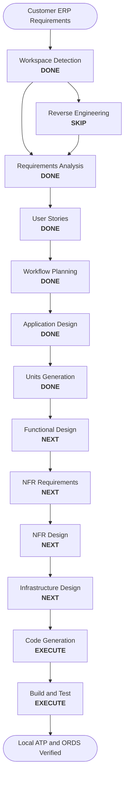

# AI-DLC Execution Plan

## Detailed Analysis Summary

- **Project Type**: Greenfield prototype.
- **Primary Change**: New supplier onboarding and integration application.
- **User-facing Changes**: Yes. The three prototype personas are requester, reviewer, and support/admin user.
- **Structural Changes**: Yes. New ATP data model, ORDS API layer, OIC integrations, and Fusion API mapping.
- **Data Model Changes**: No further model changes. Construction realizes the finalized 18-table schema as Oracle DDL without adding application tables.
- **API Changes**: Yes. New ORDS APIs and OIC integration APIs.
- **NFR Impact**: High. Security, auditability, data masking, explainability, observability, retry, and resiliency matter.
- **Risk Level**: High for production, Medium for prototype.
- **Testing Complexity**: Moderate to complex because duplicate/risk scoring, integration failures, and security boundaries must be tested.

## Recommended AI-DLC Stages

| Stage | Decision | Reason |
|---|---|---|
| Workspace Detection | Executed | Required, greenfield workspace. |
| Reverse Engineering | Skipped | No existing codebase. |
| Requirements Analysis | Execute | Complex customer transcript with multiple stakeholders. |
| User Stories | Execute | Multiple personas and workflows. |
| Workflow Planning | Execute | Required. |
| Application Design | Execute | New components, APIs, integrations, and data model. |
| Units Generation | Execute | Multiple logical units can be built/tested independently. |
| Functional Design | Execute per unit | Business rules need detail. |
| NFR Requirements | Execute per unit | Security, masking, observability, AI safety, resiliency. |
| NFR Design | Execute per unit | Needed for production-realistic prototype. |
| Infrastructure Design | Execute per unit | Oracle stack and integration environment decisions. |
| Code Generation | Execute per unit | Generate local ATP/ORDS runtime, migrations, PL/SQL, ORDS definitions, mock integrations, seed data, tests, and reports after each approved unit plan. |
| Build and Test | Execute | Run migrations, seed all tables, execute full test gates, and produce consolidated evidence. |

## Workflow Visualization

Text alternative: requirements move from workspace detection to requirements, stories, workflow planning, application design, units, then construction-stage detailed designs before any code generation.

## Next Recommended Action

Review and approve `aidlc-docs/construction/plans/oracle-atp-ords-construction-plan.md`. After approval, begin UOW-001 Functional Design, followed by the required per-unit NFR, infrastructure, code-generation, and review gates. The plan uses Oracle Autonomous AI Database Free 26ai in ATP mode with bundled ORDS, preserves the finalized schema, implements all approved ORDS contracts, seeds every table, and ends with comprehensive test and migration reports.
