# User Story Sequence Diagrams

## Purpose and Scope

This document provides a sequence diagram for every user story in `stories.md`. The diagrams are interaction views of the approved story behavior; the user stories, acceptance criteria, requirements, and technical design remain the source of truth.

## Shared Architectural Guardrails

- Oracle Visual Builder communicates with Oracle ATP only through versioned ORDS APIs.
- Oracle ATP stores request workflow state, rule outputs, audit history, reference data, and integration logs.
- OIC owns Fusion ERP or mock Fusion integration; Visual Builder never creates suppliers in Fusion directly.
- AI explains deterministic validation, duplicate, and risk facts but never approves, rejects, marks duplicate, routes, or creates a supplier.
- Bank data used in matching is masked or tokenized; full bank account values are not sent to AI or exposed in logs.

## Sequence Diagrams

### US-001: Create and submit supplier request

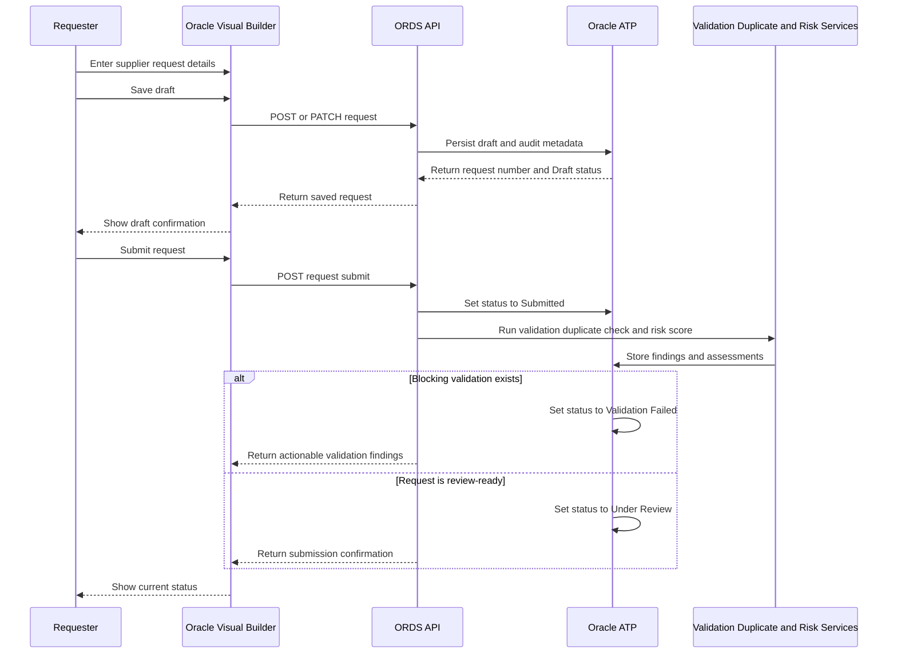

Text alternative: The requester saves a guided draft through Visual Builder and ORDS into ATP. On submission, deterministic validation, duplicate, and risk checks run; ATP records either Validation Failed with findings or Under Review.

### US-002: Correct returned request

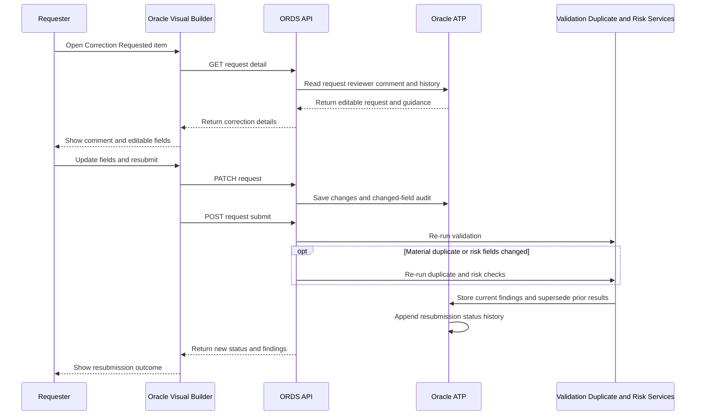

Text alternative: A requester opens a returned request, sees the reviewer comment, edits the existing record, and resubmits it. The system reruns validation and, for material changes, duplicate and risk checks, while preserving status history.

### US-003: Track request status and outcome

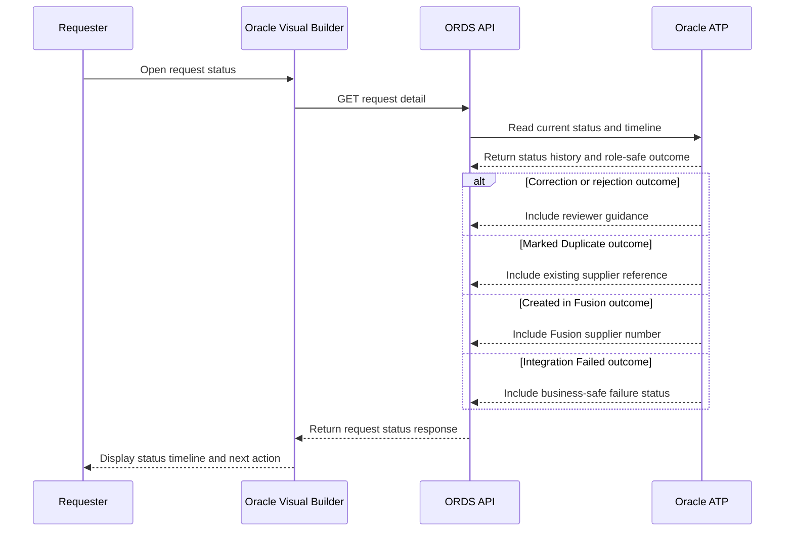

Text alternative: The requester retrieves a role-safe status view through ORDS. ATP supplies the timeline plus the relevant outcome details, such as reviewer guidance, an existing supplier reference, a Fusion supplier number, or a business-safe failure message.

### US-004: Review validation and duplicate evidence

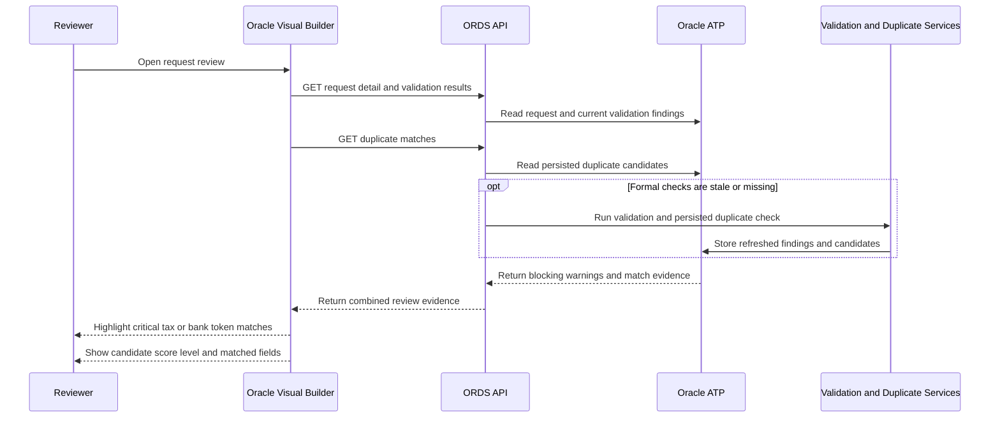

Text alternative: The reviewer opens a combined evidence view. ORDS reads or refreshes validation and formal duplicate results in ATP, then Visual Builder highlights blocking findings, candidate details, scores, matched fields, and critical tax or bank-token matches.

### US-005: Review risk score and reasons

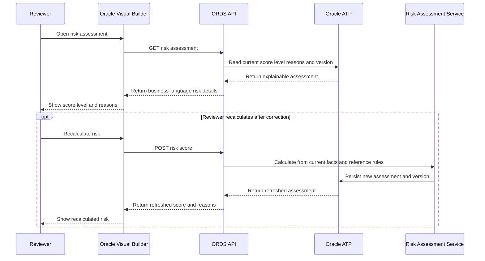

Text alternative: The reviewer views the current explainable risk result. A recalculation reads current validation, duplicate, country, bank, address, justification, spend, document, and mapping facts, applies ATP-configured rules, and stores a versioned assessment.

### US-006: Use AI explanation safely

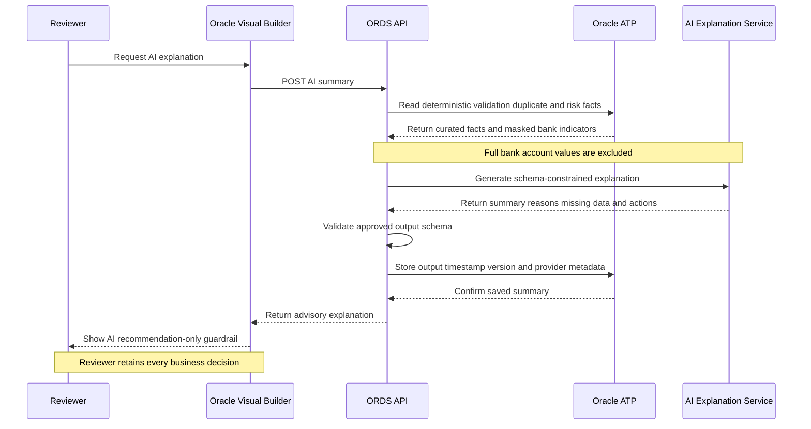

Text alternative: ORDS assembles curated deterministic facts with masked bank indicators, sends them to the AI explanation service, validates the structured response, and stores its metadata. The reviewer sees advisory guidance only and remains responsible for the decision.

### US-007: Make review decision

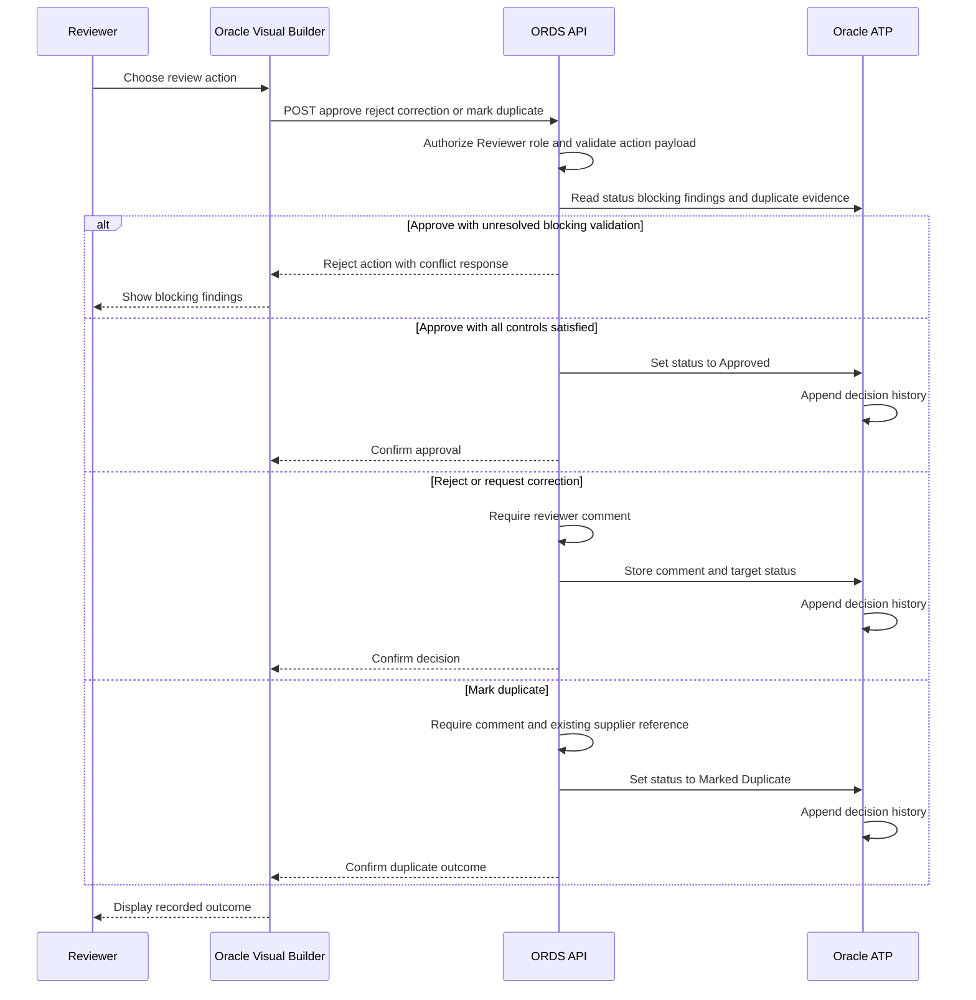

Text alternative: ORDS authorizes and validates the reviewer action. Approval is blocked by unresolved validations; rejection and correction require comments; duplicate marking requires both a comment and an existing supplier reference. ATP records every valid decision in status history.

### US-008: See decision guidance

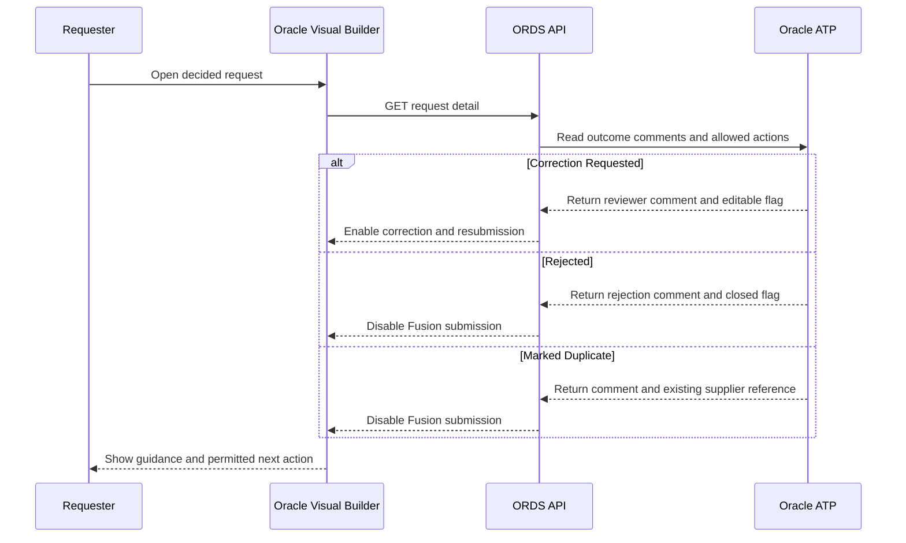

Text alternative: The requester receives guidance appropriate to the recorded decision. Correction Requested remains editable and resubmittable, while Rejected and Marked Duplicate are closed to Fusion submission; duplicate outcomes include the supplier reference to use.

### US-009: Use business dashboards

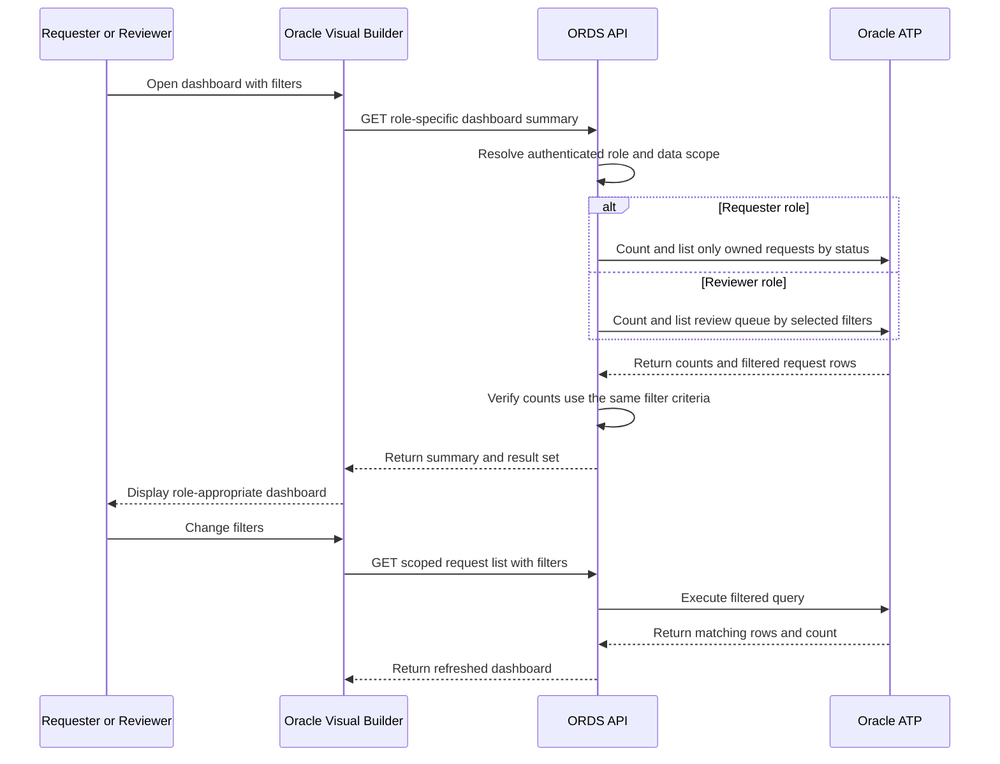

Text alternative: ORDS applies the authenticated role and identical filters to dashboard counts and result rows. Requesters see only their requests, while reviewers see the review queue with business filters such as BU, country, status, risk, duplicate risk, spend, and category.

### US-010: Troubleshoot integrations

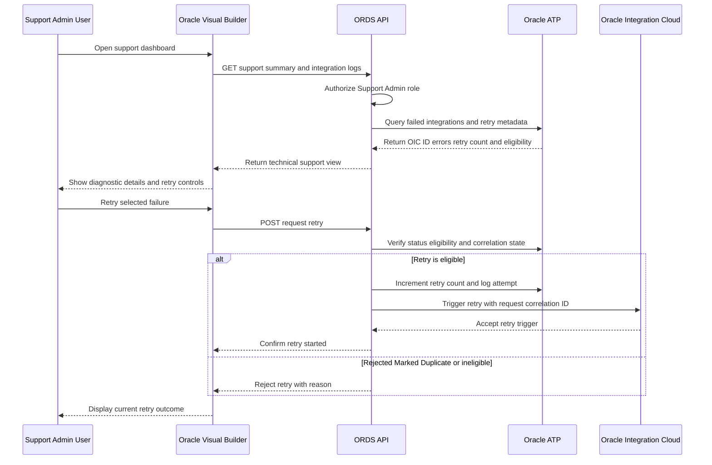

Text alternative: A support/admin user retrieves protected integration diagnostics and retry metadata. ORDS permits retries only after status, eligibility, and correlation checks, records the attempt, and triggers OIC; rejected, duplicate, or otherwise ineligible requests remain blocked.

### US-011: Submit approved supplier to Fusion

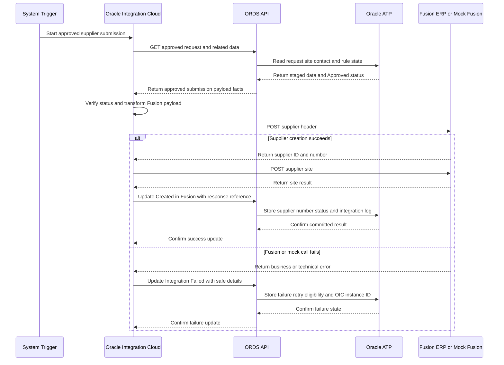

Text alternative: A system trigger starts OIC, which retrieves only an approved staged request through ORDS, transforms it, and calls Fusion or the mock. Success stores the supplier number and Created in Fusion status; failure stores Integration Failed details and retry metadata in ATP.

### US-012: Load supplier reference data

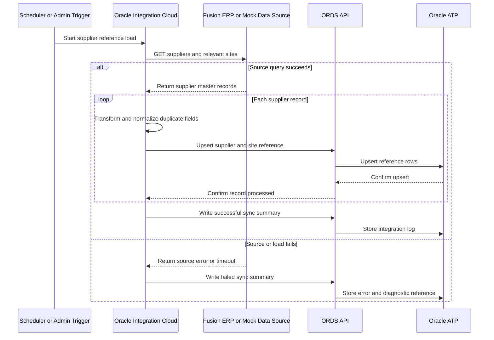

Text alternative: A scheduled or administrative OIC flow reads suppliers and sites from Fusion or mock data, normalizes duplicate-relevant fields, upserts ATP reference rows through ORDS, and records a success or failure summary for support visibility.

### US-013: Maintain reference and sensitive-data controls

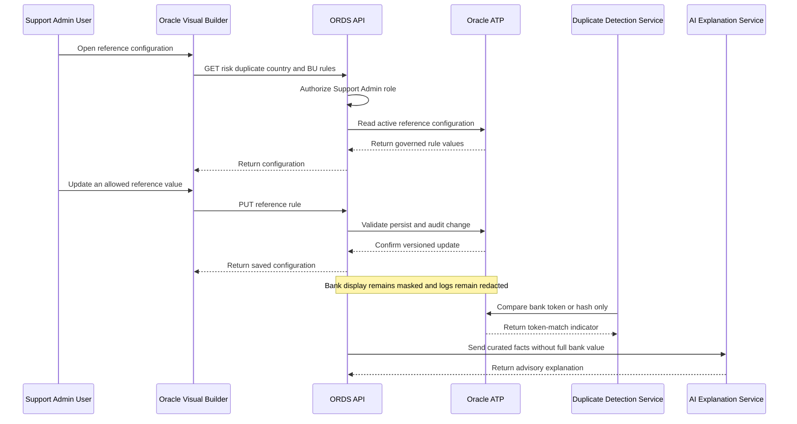

Text alternative: A support/admin user maintains authorized reference rules through ORDS with audit history. Across processing, ATP exposes only masked bank display values and token/hash indicators, duplicate matching uses those indicators, logs remain redacted, and AI receives no full bank value.

### US-014: Run realistic demo scenarios

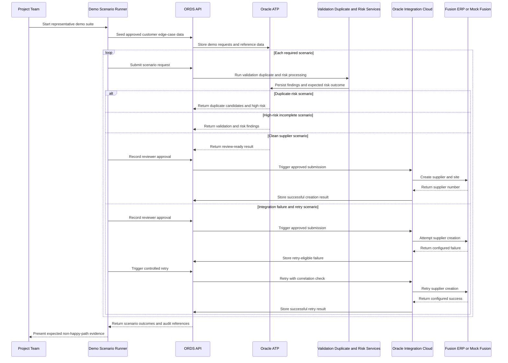

Text alternative: The project team runs seeded scenarios for duplicate risk, high-risk incomplete data, clean supplier creation, and integration failure with controlled retry. Each scenario uses the same ORDS, ATP, deterministic rule, OIC, and Fusion/mock boundaries as the proposed solution and returns auditable outcomes.

## Coverage Summary

| Story | Sequence focus |
|---|---|
| US-001 | Draft creation, submission, validation, duplicate detection, and risk processing |
| US-002 | Correction, material-change detection, and resubmission |
| US-003 | Role-safe status timeline and outcome details |
| US-004 | Combined validation and duplicate evidence review |
| US-005 | Explainable risk retrieval and recalculation |
| US-006 | Curated AI explanation with decision and sensitive-data guardrails |
| US-007 | Controlled reviewer decision branches |
| US-008 | Requester guidance and permitted next actions |
| US-009 | Role-scoped dashboards, filters, counts, and results |
| US-010 | Protected diagnostics and controlled integration retry |
| US-011 | Approved supplier submission through OIC to Fusion or mock Fusion |
| US-012 | Fusion or mock supplier-reference synchronization into ATP |
| US-013 | Governed reference configuration and sensitive-data handling |
| US-014 | Representative happy-path and non-happy-path demo execution |

## Validation Notes

- All 14 story IDs and titles match `stories.md`.
- Each story has one Mermaid sequence diagram and one text alternative.
- Participant identifiers use alphanumeric names only.
- Mermaid control blocks are balanced and labels avoid unescaped quotation marks.
- The diagrams preserve the approved ORDS, ATP, OIC, Fusion, AI, role, and sensitive-data boundaries.
