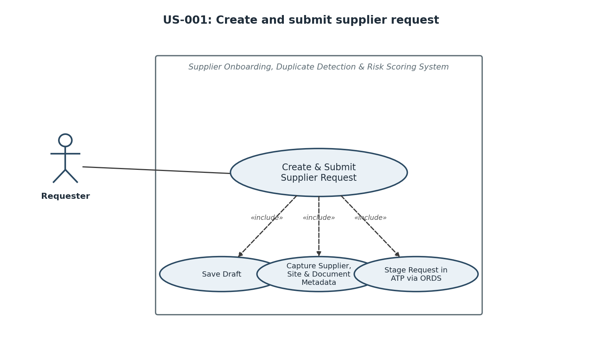
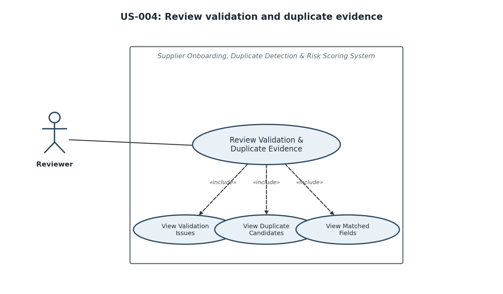
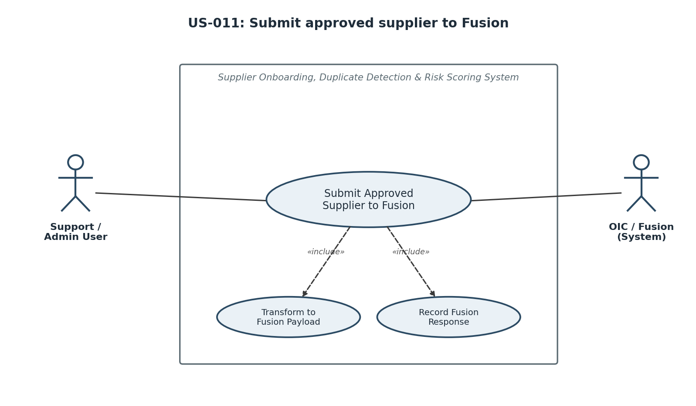

# User Stories

## Story Map

| Area | Stories | Primary Persona/Actor |
|---|---|---|
| Request intake and status | US-001, US-002, US-003 | Requester |
| Review intelligence | US-004, US-005, US-006 | Reviewer |
| Review decisions | US-007, US-008 | Reviewer, Requester |
| Dashboards and support | US-009, US-010 | Requester, Reviewer, Support/Admin |
| Fusion integration | US-011, US-012 | Support/Admin, System |
| Configuration and demo | US-013, US-014 | Support/Admin, System |

## Detailed Stories

| Story ID | Title | Actor | Priority | User Story | Acceptance Criteria | Related Functional Requirements |
|---|---|---|---|---|---|---|
| US-001 | Create and submit supplier request | Requester | Must | As a Requester, I want to create, save, and submit a guided supplier request so that onboarding starts with complete standardized data. | 1. Requester can save Draft and submit when ready. 2. Form captures supplier, contact, structured address/site fields, business justification, category, spend, conditional tax, optional bank indicators, and document metadata. 3. Required fields are clear. 4. Request is stored in ATP through ORDS. 5. Visual Builder does not call Fusion directly. 6. Submission is blocked when critical duplicate triggers or blocking validation errors are found. | FR-001, FR-003, FR-004, FR-005 |
| US-002 | Correct returned request | Requester | Must | As a Requester, I want to correct and resubmit returned requests so that missing or unclear information can be fixed without starting over. | 1. Correction Requested requests are editable by the requester. 2. Reviewer comment is visible. 3. Resubmission reruns validation, duplicate, and risk checks where material fields changed. 4. Status history records the resubmission. | FR-001, FR-002, FR-005 |
| US-003 | Track request status and outcome | Requester | Must | As a Requester, I want to track my supplier request status so that I know whether it is submitted, under review, rejected, duplicate, created, or failed. | 1. Requester sees current status and timeline. 2. Rejection/correction/duplicate comments are visible. 3. Duplicate outcome shows the existing supplier reference to use. 4. Created in Fusion shows supplier number where available. 5. Requester view does not expose internal risk scores, levels, reasons, or AI review evidence. | FR-002, FR-009 |
| US-004 | Review validation and duplicate evidence | Reviewer | Must | As a Reviewer, I want validation issues and duplicate candidates shown together so that I can judge whether the request should proceed. | 1. Blocking and warning validations are visible. 2. Duplicate candidates show supplier number/name/country, score/level, and matched fields. 3. Exact tax ID and same bank token/hash are highlighted as Critical by default. 4. Duplicate detection runs automatically during submit/resubmit validation; Requesters do not manually run a duplicate-preview button. | FR-005, FR-006 |
| US-005 | Review risk score and reasons | Reviewer | Must | As a Reviewer, I want an explainable risk score and reasons so that I know what to verify before making a decision. | 1. Risk level and reasons are visible in business language. 2. Factors include missing tax where configured as warning, high-risk country, bank mismatch, incomplete address, vague justification, high spend, duplicate signals, missing documents, invalid BU mapping, and missing/incomplete bank details. 3. Risk can be recalculated after correction. 4. Thresholds/weights and active/inactive risk-factor settings are Admin Settings driven. | FR-007 |
| US-006 | Use AI explanation safely | Reviewer | Must | As a Reviewer, I want AI to explain risk, duplicate reasons, missing information, and recommended actions so that review is easier without AI making the decision. | 1. AI output follows approved schema. 2. AI does not approve, reject, mark duplicate, route escalation automatically, or create suppliers. 3. AI summary is stored with timestamp/version/provider metadata where available. 4. AI receives no full bank account number. 5. Helpful/not-helpful feedback is future enhancement. | FR-008, FR-014 |
| US-007 | Make review decision | Reviewer | Must | As a Reviewer, I want to approve, reject, request correction, or mark duplicate so that each request has a controlled business outcome. | 1. Approve is blocked until blocking validation is resolved. 2. Reject, request correction, and mark duplicate require comments. 3. Request correction can target specific validation, risk, or evidence items. 4. Mark duplicate requires existing supplier reference. 5. High-risk or duplicate-risk requests cannot bypass manual review. 6. Decision is stored in status history. | FR-009 |
| US-008 | See decision guidance | Requester | Must | As a Requester, I want to see reviewer guidance after rejection, correction, or duplicate marking so that I know what to do next. | 1. Rejection and correction comments are visible. 2. Duplicate requests show existing supplier reference. 3. Correction Requested can be edited/resubmitted. 4. Rejected and Marked Duplicate cannot be submitted to Fusion. | FR-002, FR-009 |
| US-009 | Use business dashboards | Requester, Reviewer | Must | As a Requester or Reviewer, I want role-appropriate dashboards and filters so that I can find and prioritize supplier requests. | 1. Requester sees own draft/submitted/correction/created/rejected/duplicate requests. 2. Requester dashboard actions show `Edit and Resubmit` only for `Correction Requested`; all other request rows show non-clickable `None`. 3. Reviewer sees pending, under-review, high-risk, duplicate-risk, recently-created, and failed requests. 4. Reviewer filters include BU, country, supplier type, requester, status, risk, duplicate risk, spend, and category. 5. Counts match filtered results. | FR-010 |
| US-010 | Troubleshoot integrations | Support/Admin User | Must | As a Support/Admin User, I want integration logs and retry controls so that I can diagnose and recover eligible failures. | 1. Dashboard shows failed integrations, retry eligibility, OIC instance ID, retry count, and error messages. 2. Technical error details are visible to Support/Admin only. 3. Retry is available for eligible technical/corrected business failures. 4. Retry is blocked for Rejected and Marked Duplicate requests. | FR-010, FR-013 |
| US-011 | Submit approved supplier to Fusion | System | Must | As the system, I want OIC to submit approved supplier requests to Fusion or a realistic mock so that creation follows the integration layer. | 1. OIC reads approved staged data. 2. OIC transforms to Fusion supplier payload. 3. OIC creates supplier header and at least one site where supported. 4. Success stores supplier number. 5. Failure stores Integration Failed with details. | FR-011 |
| US-012 | Load supplier reference data | System | Must | As the system, I want existing supplier reference data in ATP so that duplicate detection compares against representative supplier master data. | 1. Prototype uses mock supplier master by default. 2. OIC sync design is documented for real Fusion. 3. Reference data includes duplicate-relevant fields. 4. Load/sync errors are logged. | FR-012 |
| US-013 | Maintain Admin Settings and sensitive-data controls | Support/Admin User | Should | As a Support/Admin User, I want Admin Settings and sensitive-data handling controls so that validation, risk, duplicate, and masking behavior stays governed. | 1. High-risk countries, BU mappings, supplier types, validation rules, risk factors, and thresholds are seeded/configuration-driven. 2. Admin Settings shows active/inactive controls for selected validation rules and risk factors in the phase-one mockup/docs. 3. Bank display is masked. 4. Bank duplicate checks use token/hash where captured. 5. Full bank values are not sent to AI or exposed in logs. 6. Document metadata/missing flags are visible without requiring upload. | FR-014 |
| US-014 | Run realistic demo scenarios | System | Must | As the project team, we want representative data and non-happy-path demo flows so that the customer can validate the business value. | 1. Demo includes duplicate-risk request. 2. Demo includes clean supplier creation. 3. Demo includes high-risk incomplete request. 4. Demo includes integration failure with retry. 5. Demo data includes all customer-requested edge cases. | FR-015 |

## Story Coverage Notes

| Topic | Coverage |
|---|---|
| Story count | Consolidated to 14 stories for proposal-stage readability. |
| Three personas only | The only user personas are Requester, Reviewer, and Support/Admin User. System appears only as an automated backend actor, not as an application persona. |
| Single reviewer | Reviewer owns all business review decisions in the prototype. |
| AI guardrail | AI stories only generate explanations and recommendations; decision remains with Reviewer. |
| Fusion boundary | Integration stories keep Fusion creation behind OIC. |
| NFR coverage | Non-functional requirements apply across stories and are tracked separately from the story-to-FR mapping. US-013 also supports NFR-004 for sensitive data protection. |
| Wireframes | Stories are ready to drive later wireframes, but no wireframes are generated in this phase. |

## Selected Use Case Diagrams

These diagrams are visual companions to the story table. The acceptance criteria and functional requirement mappings above remain the source of truth.

### US-001: Create and Submit Supplier Request

### US-004: Review Validation and Duplicate Evidence

### US-011: Submit Approved Supplier to Fusion

