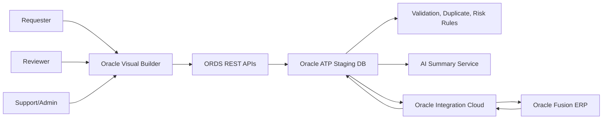

# Proposal: Supplier Onboarding, Duplicate Detection, and Risk Scoring

## Executive Summary

The customer needs a standardized supplier onboarding application that prevents duplicate supplier creation, improves supplier master data quality, and gives procurement, finance, compliance, and IT clear visibility into supplier request status.

We propose a three-week prototype using the Oracle stack requested by the customer:

- Oracle Visual Builder for requester, reviewer, and support/admin UI.
- Oracle ATP as staging, validation, risk, duplicate, and integration tracking database.
- ORDS REST APIs to expose ATP services to Visual Builder.
- Oracle Integration Cloud for Fusion ERP supplier master synchronization and approved supplier creation.
- Oracle Fusion ERP as the system of record for created suppliers.
- AI-assisted risk and duplicate explanations with human review retained as the approval authority.

## Business Outcomes

- Reduce duplicate supplier creation before it reaches Fusion.
- Improve request data quality through guided capture and validation.
- Give reviewers explainable duplicate and risk reasons.
- Give requesters clear status tracking.
- Give support/admin users actionable integration logs and retry control.
- Demonstrate value through realistic success, duplicate-risk, high-risk, and integration-failure scenarios.

## Proposed Scope

### In Scope

- Supplier request form and detail pages.
- Request dashboard for requesters and reviewers.
- Support/admin integration dashboard.
- ATP schema for requests, sites, governed validation rules/results, consolidated risk/duplicate scoring configuration, AI summaries, existing suppliers, and integration logs.
- ORDS APIs for UI operations.
- Duplicate detection using exact and fuzzy matching.
- Optional early duplicate warning while entering supplier data, if schedule allows.
- Explainable rule-based risk scoring.
- AI-generated summaries and recommended actions.
- OIC supplier creation flow to Fusion or mock Fusion endpoint.
- OIC supplier master sync flow from Fusion or mock data load.
- Attachment/document metadata and missing-document flags, without requiring full upload in phase one.
- Sample data and demo script.

### Out of Scope For Phase One

- Full enterprise approval workflow.
- Supplier merge.
- Existing supplier update process.
- Third-party sanctions screening.
- Email notification.
- Production-grade attachment upload.
- AI-made approval/rejection decisions.

## Target Architecture

Text alternative: requester, reviewer, and support/admin users work in Visual Builder. Visual Builder calls ORDS, ORDS reads/writes ATP, ATP stores workflow data and rule outputs, OIC integrates approved requests with Fusion and synchronizes supplier master reference data back into ATP.

## Delivery Plan

### Week 1: Foundation and Request Flow

- Review answered assumptions and finalize any changed decisions.
- Define ATP schema and reference data.
- Build core ORDS APIs.
- Build Visual Builder request submission and request list screens.
- Seed sample supplier master and request scenarios.

### Week 2: Duplicate, Risk, AI, and Review

- Implement validation rules.
- Implement duplicate scoring and match explanations.
- Implement risk scoring.
- Add AI summary generation or mock summary service.
- Build reviewer dashboard and review actions.

### Week 3: Fusion/OIC Integration and Demo Hardening

- Build OIC submit-to-Fusion pattern using real or mock endpoint.
- Build supplier master sync pattern.
- Add integration logs and retry.
- Prepare demo script and known limitations.
- Run end-to-end scenarios and polish proposal/demo artifacts.

## Acceptance Criteria

- Requester can submit a supplier request through Visual Builder.
- Request status is visible from submission through review and Fusion creation/failure.
- Reviewer can see duplicate candidates with matched reasons.
- Reviewer can see risk level and rule explanations.
- AI summary explains risk and recommended action without making the decision.
- Approved clean request is submitted to Fusion or a Fusion-like mock and stores supplier number.
- Failed integration shows OIC instance ID, error details, timestamp, and retry count.
- Demo includes success, duplicate, high-risk, and integration failure scenarios.

## Known Limitations

- Prototype duplicate matching is explainable but not a full enterprise matching engine.
- External sanctions screening is excluded.
- Real Fusion API payloads and privileges must be validated against the customer's Fusion release and security setup.
- Bank data handling is simplified and must be hardened before production.
- Production identity, SSO, and audit controls need customer environment decisions.

## Commercial/Delivery Notes

This is a discovery-to-prototype proposal. It should be reviewed with procurement, finance, master data governance, compliance, and IT before committing to build scope. Any production extension should add formal security review, data protection review, environment strategy, access control design, test strategy, and operational support model.
